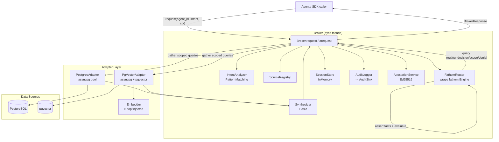

# Design: Nautilus Core Broker (Phase 1)

## 1. Overview

Nautilus Core Broker is a greenfield Python package that mediates between AI agents and data sources using the Fathom rules engine for routing, scoping, and denial decisions. The broker exposes a synchronous Python SDK (`Broker.request`) that drives async adapter fan-out internally via `asyncio.run()` + `asyncio.gather()`, while also offering `Broker.arequest` for callers already inside a running event loop. Fathom is the source of truth for policy: rules assert into three Nautilus-owned templates (`routing_decision`, `scope_constraint`, `denial_record`) and the broker reads them back after `engine.evaluate()` rather than relying on Fathom's last-write-wins `EvaluationResult.decision`.

The Phase 1 architecture is deliberately Protocol-first: `IntentAnalyzer`, `Adapter`, `Synthesizer`, `SessionStore`, `Embedder`, and `AuditSink` are all pluggable, with shipped defaults (`PatternMatchingIntentAnalyzer`, `PostgresAdapter`, `PgVectorAdapter`, `BasicSynthesizer`, `InMemorySessionStore`, `NoopEmbedder`, Fathom's `FileSink`). This keeps the Phase 1 surface minimal but unblocks Phase 2/3 extensions (LLM intent, Redis session, real embedders, LLM synthesizer) without public API changes. Attestation is wired up in Phase 1 with a broker-owned `AttestationService` that auto-generates an Ed25519 keypair on first run and signs every `BrokerResponse`.

The broker is structured as subpackages by role: `nautilus/{core,adapters,analysis,config,rules,audit,synthesis}/`. Built-in default rules ship under `nautilus/rules/{templates,modules,functions,rules}/` following Fathom's convention and are auto-loaded at broker construction; user rules declared in `nautilus.yaml` layer on top. The test surface is split into `tests/unit/` (no Docker) and `tests/integration/` (testcontainers-backed PostgreSQL with pgvector) with pytest markers `unit` and `integration`. Coverage floor is 80% on `nautilus/`.

---

## 2. Architecture



Request flow (happy path):
1. SDK call enters `Broker.request`; detects running loop (UQ-4) and raises if present.
2. `IntentAnalyzer.analyze()` produces `IntentAnalysis`.
3. `SessionStore.get(session_id)` fetches session snapshot.
4. `FathomRouter.route()` asserts `agent`, `intent`, each `source`, and `session` facts; calls `engine.evaluate()`; queries `routing_decision`, `scope_constraint`, `denial_record`; captures `rule_trace`.
5. Broker builds per-source `AdapterJob` list, runs `asyncio.gather(*[adapter.execute(...) for ...])`.
6. `Synthesizer.merge()` produces `data`.
7. `AttestationService.sign()` produces token.
8. `AuditLogger.emit(AuditEntry)` writes one JSONL line.
9. Broker returns `BrokerResponse`.

---

## 3. Component Responsibilities

### 3.1 `Broker` (`nautilus/core/broker.py`)

**Purpose.** Public facade. Orchestrates the request pipeline and owns all adapter/session/audit lifecycles.

**Public surface.**
```python
class Broker:
    @classmethod
    def from_config(cls, path: str | Path) -> "Broker": ...
    def request(self, agent_id: str, intent: str, context: dict) -> BrokerResponse: ...
    async def arequest(self, agent_id: str, intent: str, context: dict) -> BrokerResponse: ...
    def close(self) -> None: ...
    async def aclose(self) -> None: ...
    @property
    def sources(self) -> list[SourceConfig]: ...
```

**Collaborators.** `SourceRegistry`, `IntentAnalyzer`, `FathomRouter`, `SessionStore`, `Adapter` (per source), `Synthesizer`, `AuditLogger`, `AttestationService`.

**Invariants.**
- Every call to `request`/`arequest` produces exactly one `AuditEntry` (success or failure) — NFR-8.
- `request` never runs inside a foreign event loop; if detected, raises `RuntimeError` pointing at `arequest` — UQ-4, AC-8.5.
- `close()` is idempotent — FR-17, AC-8.6.

**Failure modes.**
- Config load error → `ConfigError` raised from `from_config` before any connection.
- Runtime adapter exception → surfaced in `sources_errored`, request still returns.
- Fathom engine error → `PolicyEngineError` raised to caller, audit entry still written.

### 3.2 `SourceRegistry` (`nautilus/config/registry.py`)

**Purpose.** Load, validate, and expose source configs from YAML.

**Public surface.**
```python
class SourceRegistry:
    sources: list[SourceConfig]
    def get(self, source_id: str) -> SourceConfig: ...
    def __iter__(self) -> Iterator[SourceConfig]: ...
```

**Collaborators.** `yaml.safe_load`, `os.environ` (via `EnvInterpolator`), `SourceConfig` Pydantic model.

**Invariants.**
- IDs are unique; duplicates raise `ConfigError` — AC-1.3.
- All `${ENV_VAR}` placeholders resolved at load; missing var → `ConfigError` naming var + source id — AC-1.2, NFR-5.
- Only supported `type` values (`postgres`, `pgvector`) accepted in Phase 1.

### 3.3 `IntentAnalyzer` Protocol + `PatternMatchingIntentAnalyzer`

**Location.** `nautilus/analysis/base.py`, `nautilus/analysis/pattern_matching.py`.

**Protocol.**
```python
class IntentAnalyzer(Protocol):
    def analyze(self, intent: str, context: dict) -> IntentAnalysis: ...
```

**`PatternMatchingIntentAnalyzer` responsibilities.**
- Load keyword→data-type map from optional `nautilus.yaml` `analysis:` stanza or defaults.
- Scan intent for keywords → populate `data_types_needed`.
- Regex-extract entities (CVE IDs at minimum: `r"CVE-\d{4}-\d{4,}"`).
- Populate `temporal_scope` via date regex; `estimated_sensitivity` via keyword map.

**Invariants.**
- Pure function of `(intent, context, config)` — NFR-13.
- No network, no LLM, no filesystem I/O after construction — NFR-15.

### 3.4 `FathomRouter` (`nautilus/core/fathom_router.py`)

**Purpose.** Thin wrapper around `fathom.Engine` that owns template registration, default-rule loading, user-rule loading, fact assertion, and result extraction.

**Public surface.**
```python
class FathomRouter:
    def __init__(
        self,
        built_in_rules_dir: Path,
        user_rules_dirs: list[Path],
        attestation: AttestationService | None = None,
    ) -> None: ...

    def route(
        self,
        agent_id: str,
        context: dict,
        intent: IntentAnalysis,
        sources: list[SourceConfig],
        session: dict,
    ) -> RouteResult: ...

    def close(self) -> None: ...
```

Where:
```python
@dataclass
class RouteResult:
    routing_decisions: list[RoutingDecision]
    scope_constraints: dict[str, list[ScopeConstraint]]
    denial_records: list[DenialRecord]
    rule_trace: list[str]
    duration_us: int
```

**Collaborators.** `fathom.Engine`, Nautilus YAML templates, Nautilus rules, user rules.

**Invariants.**
- Built-in templates `routing_decision`, `scope_constraint`, `denial_record` always registered — AC-3.1.
- For each request, engine working memory is cleared before assertions (`engine.clear_facts()`), asserted atomically via `assert_facts()` — AC-3.2.
- `routing_decisions` reflects every `routing_decision` fact, not `EvaluationResult.decision` — FR-6, AC-3.3.
- `rule_trace` is captured verbatim — FR-7, AC-3.5.
- Owns list↔string encoding for CLIPS multislot fields: before asserting `intent`/`source` facts, the router joins `list[str]` slots into space-separated strings (and quotes any value containing whitespace). CLIPS rules use `explode$` to decompose.

**Failure modes.**
- Engine construction failure → `PolicyEngineError` raised at broker construction, not per request.
- Fact assertion validation error → `PolicyEngineError` with fact payload.

### 3.5 `Adapter` base + `PostgresAdapter` + `PgVectorAdapter`

**Location.** `nautilus/adapters/base.py`, `nautilus/adapters/postgres.py`, `nautilus/adapters/pgvector.py`.

**Protocol.**
```python
class Adapter(Protocol):
    source_type: ClassVar[str]
    async def connect(self, config: SourceConfig) -> None: ...
    async def execute(
        self,
        intent: IntentAnalysis,
        scope: list[ScopeConstraint],
        context: dict,
    ) -> AdapterResult: ...
    async def close(self) -> None: ...
```

**`PostgresAdapter`.**
- Owns an `asyncpg.Pool`; `connect()` creates it via `asyncpg.create_pool(dsn)`.
- Builds `SELECT * FROM <table> WHERE <scope predicates> LIMIT $N` using parameterized `$1..$N` placeholders exclusively.
- Operator allowlist validated at load time (see §7).
- Returns `AdapterResult(source_id, rows, duration_ms)`.

**`PgVectorAdapter`.**
- Extends `PostgresAdapter`; same pool mechanics.
- Resolves embedding via precedence `context["embedding"]` → per-source embedder → broker-default embedder (see §8).
- Query: `SELECT ... FROM <table> WHERE <scope> ORDER BY embedding <op> $N LIMIT $M` where `<op>` is one of `<=>`, `<->`, `<#>` per source config.

**Invariants.**
- Zero string interpolation of user values — NFR-4, AC-4.1.
- Unknown operator → `ScopeEnforcementError`, caller converts to `sources_errored` entry — AC-4.3.
- `close()` releases pool once, idempotent — FR-17.

### 3.6 `Synthesizer` Protocol + `BasicSynthesizer`

**Location.** `nautilus/synthesis/base.py`, `nautilus/synthesis/basic.py`.

```python
class Synthesizer(Protocol):
    def merge(self, results: list[AdapterResult]) -> dict[str, list[dict]]: ...
```

`BasicSynthesizer.merge()` returns `{source_id: rows}`; never raises on per-adapter failure (those are filtered into `sources_errored` before reaching synth).

### 3.7 `AuditLogger` + `AuditSink`

**Location.** `nautilus/audit/logger.py` (Nautilus) + `fathom.audit` (Fathom-provided).

- `AuditLogger` wraps a Fathom `AuditSink` and accepts `AuditEntry` Pydantic models.
- Default sink is Fathom's `FileSink` at configurable path (`audit_path` in `nautilus.yaml`, default `./audit.jsonl`).
- Writes append-only JSON Lines; one line per request — AC-7.1, AC-7.3, NFR-8.

### 3.8 `AttestationService`

Reused from `fathom.attestation.AttestationService`. Broker constructs it as:
1. If `attestation.private_key_path` in config → load key.
2. Else → `AttestationService.generate_keypair()`.
3. Every successful response gets a signed token whose payload includes `request_id`, `agent_id`, `sources_queried`, `scope_hash`, `rule_trace_hash`, `timestamp`.

### 3.9 `SessionStore` Protocol + `InMemorySessionStore`

**Location.** `nautilus/core/session.py`.

```python
class SessionStore(Protocol):
    def get(self, session_id: str) -> dict: ...
    def update(self, session_id: str, entry: dict) -> None: ...
```

`InMemorySessionStore` is a dict per Broker instance. Phase 2 swap-target.

Phase 1 calls `SessionStore.get()` to read prior state and `SessionStore.update()` at the end of each successful request; Phase 2 adds rules that actually reason on accumulated state.

### 3.10 `Embedder` Protocol + `NoopEmbedder`

**Location.** `nautilus/adapters/embedder.py`.

```python
class Embedder(Protocol):
    def embed(self, text: str) -> list[float]: ...
```

`NoopEmbedder` returns a zero vector of configurable dimension OR raises `EmbeddingUnavailableError` with guidance (configurable via `strict: true`). Default is strict-raise so users don't get silent garbage results.

---

## 4. Data Model / Public Types

All models are Pydantic v2 `BaseModel` subclasses under `nautilus/core/models.py` except where noted.

### 4.1 `SourceConfig` (`nautilus/config/models.py`)
```python
class SourceConfig(BaseModel):
    id: str
    type: Literal["postgres", "pgvector"]
    description: str
    classification: str
    data_types: list[str]
    allowed_purposes: list[str] | None = None
    connection: str  # post-interpolation DSN
    # pgvector-only
    table: str | None = None
    embedding_column: str | None = None
    metadata_column: str | None = None
    distance_operator: Literal["<=>", "<->", "<#>"] | None = "<=>"
    top_k: int = 10
    embedder: str | None = None  # name of registered embedder
```

### 4.2 `IntentAnalysis`
```python
class IntentAnalysis(BaseModel):
    raw_intent: str
    data_types_needed: list[str]
    entities: list[str]
    temporal_scope: str | None = None
    estimated_sensitivity: str | None = None
```

### 4.3 `RoutingDecision`
```python
class RoutingDecision(BaseModel):
    source_id: str
    reason: str
```

### 4.4 `ScopeConstraint`
```python
class ScopeConstraint(BaseModel):
    source_id: str
    field: str
    operator: Literal["=","!=","IN","NOT IN","<",">","<=",">=","LIKE","BETWEEN","IS NULL"]
    value: Any  # validated by operator-specific rules
```

### 4.5 `DenialRecord`
```python
class DenialRecord(BaseModel):
    source_id: str
    reason: str
    rule_name: str
```

### 4.6 `ErrorRecord`
```python
class ErrorRecord(BaseModel):
    source_id: str
    error_type: str  # e.g. "ScopeEnforcementError", "AdapterError"
    message: str
    trace_id: str  # correlation to request_id
```

### 4.7 `AdapterResult`
```python
class AdapterResult(BaseModel):
    source_id: str
    rows: list[dict]
    duration_ms: int
    error: ErrorRecord | None = None
```

### 4.8 `BrokerResponse`
```python
class BrokerResponse(BaseModel):
    request_id: str
    data: dict[str, list[dict]]
    sources_queried: list[str]
    sources_denied: list[str]
    sources_skipped: list[str]
    sources_errored: list[ErrorRecord]
    scope_restrictions: dict[str, list[ScopeConstraint]]
    attestation_token: str | None
    duration_ms: int
```

### 4.9 `AuditEntry`
```python
class AuditEntry(BaseModel):
    timestamp: datetime  # UTC ISO8601
    request_id: str
    agent_id: str
    session_id: str | None
    raw_intent: str
    intent_analysis: IntentAnalysis
    facts_asserted_summary: dict[str, int]  # template -> count
    routing_decisions: list[RoutingDecision]
    scope_constraints: list[ScopeConstraint]
    denial_records: list[DenialRecord]
    error_records: list[ErrorRecord]
    rule_trace: list[str]
    sources_queried: list[str]
    sources_denied: list[str]
    sources_skipped: list[str]
    sources_errored: list[str]  # source IDs only; full error detail lives in error_records
    attestation_token: str | None
    duration_ms: int
```

Note on error shape: `AuditEntry.sources_errored` stores source IDs only for quick filtering; the full `ErrorRecord` objects live in `AuditEntry.error_records`. `BrokerResponse.sources_errored` returns the full `ErrorRecord` list for immediate caller use.

### 4.10 `NautilusConfig`
```python
class AttestationConfig(BaseModel):
    private_key_path: str | None = None
    enabled: bool = True

class RulesConfig(BaseModel):
    user_rules_dirs: list[str] = []

class AuditConfig(BaseModel):
    path: str = "./audit.jsonl"

class AnalysisConfig(BaseModel):
    keyword_map: dict[str, list[str]] = {}

class NautilusConfig(BaseModel):
    sources: list[SourceConfig]
    attestation: AttestationConfig = AttestationConfig()
    rules: RulesConfig = RulesConfig()
    audit: AuditConfig = AuditConfig()
    analysis: AnalysisConfig = AnalysisConfig()
```

---

## 5. Fathom Integration Design

### 5.1 Nautilus templates (`nautilus/rules/templates/nautilus.yaml`)

The router encodes `list[str]` fields as space-separated strings before fact assertion; CLIPS rules decompose them via `explode$`.

```yaml
templates:
  - name: agent
    slots:
      - { name: id,        type: string,  required: true }
      - { name: clearance, type: string,  required: true }
      - { name: purpose,   type: string,  required: true }

  - name: intent
    slots:
      - { name: raw,                 type: string,  required: true }
      - { name: data_types_needed,   type: string,  required: true }  # space-separated multislot
      - { name: entities,            type: string,  default: "" }

  - name: source
    slots:
      - { name: id,                type: string, required: true }
      - { name: type,              type: symbol, required: true }
      - { name: classification,    type: string, required: true }
      - { name: data_types,        type: string, required: true }  # space-separated
      - { name: allowed_purposes,  type: string, default: "" }

  - name: session
    slots:
      - { name: id,                     type: string, required: true }
      - { name: pii_sources_accessed,   type: integer, default: 0 }

  - name: routing_decision
    slots:
      - { name: source_id, type: string, required: true }
      - { name: reason,    type: string, required: true }

  - name: scope_constraint
    slots:
      - { name: source_id, type: string, required: true }
      - { name: field,     type: string, required: true }
      - { name: operator,  type: symbol, required: true }
      - { name: value,     type: string, required: true }  # stringified; typed at broker layer

  - name: denial_record
    slots:
      - { name: source_id, type: string, required: true }
      - { name: reason,    type: string, required: true }
      - { name: rule_name, type: string, required: true }
```

#### 5.1b Module declaration (`nautilus/rules/modules/nautilus-routing.yaml`)

```yaml
# nautilus/rules/modules/nautilus-routing.yaml
module: nautilus-routing
version: "1.0"
description: "Nautilus built-in routing and denial rules"
```

### 5.2 Nautilus external functions (`nautilus/rules/functions/overlaps.py`)

```python
def register_overlaps(engine):
    """Register overlaps(list_a, list_b) -> bool for space-separated strings."""
    def overlaps(a: str, b: str) -> bool:
        return bool(set(a.split()) & set(b.split()))
    engine.register_function("overlaps", overlaps)
```

Nautilus registers two Python-backed externals at engine construction: `overlaps`, and `not-in-list` (for purpose mismatch). `below` maps to Fathom's built-in `fathom-dominates` used in inverse (agent clearance does NOT dominate source classification).

### 5.3 Default rules (`nautilus/rules/rules/routing.yaml`)

```yaml
module: nautilus-routing
ruleset: nautilus-default
version: "1.0"

rules:
  - name: match-sources-by-data-type
    salience: 100
    when:
      - template: intent
        conditions:
          - slot: data_types_needed
            bind: ?needed
      - template: source
        conditions:
          - slot: id
            bind: ?sid
          - slot: data_types
            bind: ?have
          - expression: "overlaps(?needed ?have)"
    then:
      assert:
        - template: routing_decision
          slots:
            source_id: "?sid"
            reason: "data_types overlap"

  - name: deny-purpose-mismatch
    salience: 200
    when:
      - template: agent
        conditions:
          - slot: purpose
            bind: ?purpose
      - template: source
        conditions:
          - slot: id
            bind: ?sid
          - slot: allowed_purposes
            bind: ?allowed
          - expression: "(neq ?allowed \"\")"
          - expression: "(not (member$ ?purpose (explode$ ?allowed)))"
    then:
      assert:
        - template: denial_record
          slots:
            source_id: "?sid"
            reason: "purpose not authorized"
            rule_name: "deny-purpose-mismatch"
```

> Note: the `assert` action variant is used here because Nautilus rules need to write into custom templates, not emit a `__fathom_decision`. The compiler supports this via the `then.assert` form (verified against fathom compiler — see research.md).

> Note: `fathom-dominates` is the mapping target for `below()` in the design.md pseudo-DSL, but the two Phase 1 default rules (match-sources-by-data-type, deny-purpose-mismatch) do not exercise clearance comparison. The full clearance-mismatch rule — which would invoke `fathom-dominates` — lands in Phase 2 alongside the classification hierarchy work. Phase 1 only loads and registers the function; no rule fires it.

### 5.4 Fact assertion order (per request)

1. `agent` (1 fact).
2. `intent` (1 fact).
3. `source` (N facts, one per registered source).
4. `session` (1 fact).
5. `engine.evaluate()`.
6. `routing_decisions = engine.query("routing_decision")`
7. `scope_constraints = engine.query("scope_constraint")`
8. `denials = engine.query("denial_record")`
9. `rule_trace = result.rule_trace`
10. `engine.clear_facts()` at end of request for isolation.

`denial_records` trumps `routing_decisions`: any source in denials is removed from the route set and added to `sources_denied`.

---

## 6. Scope Enforcement Strategy

### 6.1 Operator allowlist

| Operator | SQL template | Param count | Value validation |
|----------|--------------|-------------|------------------|
| `=`      | `<field> = $N` | 1 | scalar |
| `!=`     | `<field> != $N` | 1 | scalar |
| `IN`     | `<field> = ANY($N::<type>[])` | 1 | list |
| `NOT IN` | `<field> <> ALL($N::<type>[])` | 1 | list |
| `<`      | `<field> < $N` | 1 | scalar |
| `>`      | `<field> > $N` | 1 | scalar |
| `<=`     | `<field> <= $N` | 1 | scalar |
| `>=`     | `<field> >= $N` | 1 | scalar |
| `LIKE`   | `<field> LIKE $N` | 1 | string |
| `BETWEEN`| `<field> BETWEEN $N AND $M` | 2 | 2-tuple of scalars |
| `IS NULL`| `<field> IS NULL` | 0 | none |

### 6.2 Field-identifier validation

Field names are validated against `r"^[A-Za-z_][A-Za-z0-9_]*(\.[A-Za-z_][A-Za-z0-9_]*)?$"` before inclusion. Unknown identifiers rejected with `ScopeEnforcementError`. Quoting uses `asyncpg`-safe identifier quoting.

### 6.3 Rejection behavior

- Operator not in allowlist at **adapter load** → `ConfigError` (fails fast).
- Operator not in allowlist at **rule assertion time** → `ScopeEnforcementError` → source added to `sources_errored`.
- Value type mismatch with operator → `ScopeEnforcementError` → `sources_errored`.

### 6.4 Example

Given `ScopeConstraint(source_id="cmdb", field="asset_type", operator="IN", value=["server","network_device"])`:

```sql
SELECT * FROM assets WHERE asset_type = ANY($1::text[]) LIMIT $2
-- params: [["server","network_device"], 1000]
```

---

## 7. pgvector Adapter Specifics

### 7.1 Similarity operators

| Op  | Distance | Typical use |
|-----|----------|-------------|
| `<=>` | cosine | default |
| `<->` | L2     | Euclidean |
| `<#>` | negative inner product | normalized vectors |

### 7.2 Embedder resolution precedence

1. `context["embedding"]: list[float]` — always accepted if present.
2. Per-source embedder named in `SourceConfig.embedder`.
3. Broker-default embedder (defaults to `NoopEmbedder(strict=True)`).

If none can produce an embedding, adapter raises `EmbeddingUnavailableError` → `sources_errored`.

### 7.3 Query template

```sql
SELECT id, metadata, embedding
FROM <table>
WHERE <scope predicates>      -- parameterized: $1, $2, ...
ORDER BY <embedding_column> <=> $E
LIMIT $L
-- params: [...scope_values, embedding_vector, top_k]
-- $E and $L are the next two positional placeholders after the scope-predicate params
```

Metadata filters are parameterized against the JSONB `metadata` column when fields are dotted (e.g., `metadata.classification` → `metadata->>'classification'`).

---

## 8. Event Loop Strategy

```python
# nautilus/core/broker.py (sketch)
def request(self, agent_id, intent, context) -> BrokerResponse:
    try:
        asyncio.get_running_loop()
    except RuntimeError:
        pass  # no loop: safe to use asyncio.run
    else:
        raise RuntimeError(
            "Broker.request() called inside a running event loop. "
            "Use Broker.arequest() (async) from async contexts."
        )
    return asyncio.run(self.arequest(agent_id, intent, context))

async def arequest(self, agent_id, intent, context) -> BrokerResponse:
    # full pipeline, gather() fan-out
    ...
```

No nest-asyncio. No background thread pool. `arequest` is safe to call from any event loop; `request` guarantees single-threaded blocking semantics for synchronous callers.

---

## 9. Audit & Attestation

### 9.1 Audit sink

Default: `fathom.audit.FileSink(path=config.audit.path)`. Writes JSON Lines. One record per `broker.request()` invocation, including on error.

### 9.2 `AuditEntry` emission rules

- Written *after* synthesis but *before* response return.
- Written even on total denial, total error, or engine exception.
- Never amended or deleted (NFR append-only).

### 9.3 Attestation token contents

```json
{
  "iss": "nautilus",
  "iat": 1712000000,
  "request_id": "uuid",
  "agent_id": "agent-alpha",
  "sources_queried": ["nvd_db","internal_vulns"],
  "rule_trace_hash": "sha256:...",
  "scope_hash": "sha256:..."
}
```

Signed Ed25519 via Fathom's `AttestationService`. Public key is derivable by the operator for downstream verification.

### 9.4 Key management

| Scenario | Behavior |
|----------|----------|
| `attestation.private_key_path` set | Load PEM from path. |
| No path, first run | `AttestationService.generate_keypair()` — keys live in-memory only. |
| `attestation.enabled: false` | `attestation_token` is `None` on every response. |

Phase 2 will add persistent key storage; Phase 1 treats ephemeral keys as acceptable.

---

## 10. Error Handling

### 10.1 Taxonomy

| Error | Module | Raised when | Surfaces as |
|-------|--------|-------------|-------------|
| `ConfigError` | `nautilus.config` | Bad YAML, missing env var, duplicate id, unsupported type | raised from `from_config` |
| `PolicyEngineError` | `nautilus.core` | Fathom engine fails to construct or evaluate | raised from `request`/`arequest` |
| `PolicyDenialError` | `nautilus.core` | (internal, never raised to caller) | drives `sources_denied` |
| `ScopeEnforcementError` | `nautilus.adapters` | Bad operator, bad field identifier, bad value type | `sources_errored` entry |
| `AdapterError` | `nautilus.adapters` | Connection failure, query failure, timeout | `sources_errored` entry |
| `EmbeddingUnavailableError` | `nautilus.adapters` | pgvector call with no usable embedder | `sources_errored` entry |
| `SynthesisError` | `nautilus.synthesis` | Synthesizer cannot merge (never for `BasicSynthesizer`) | raised from `request` (logged) |

### 10.2 Disposition table

| Condition | Response field |
|-----------|----------------|
| Source not selected by routing | `sources_skipped` |
| Source selected but Fathom asserted `denial_record` | `sources_denied` |
| Source selected, adapter raised runtime exception | `sources_errored` |
| Source selected, query returned rows | `data[source_id]` + `sources_queried` |

---

## 11. File Structure

```
nautilus/
├── __init__.py                       # re-exports Broker, BrokerResponse
├── core/
│   ├── __init__.py
│   ├── broker.py                     # Broker facade
│   ├── fathom_router.py              # Engine wrapper
│   ├── session.py                    # SessionStore + InMemorySessionStore
│   └── models.py                     # shared Pydantic models
├── config/
│   ├── __init__.py
│   ├── loader.py                     # YAML + env interpolation
│   ├── registry.py                   # SourceRegistry
│   └── models.py                     # NautilusConfig, SourceConfig
├── analysis/
│   ├── __init__.py
│   ├── base.py                       # IntentAnalyzer Protocol
│   └── pattern_matching.py           # PatternMatchingIntentAnalyzer
├── adapters/
│   ├── __init__.py
│   ├── base.py                       # Adapter Protocol, ScopeEnforcementError
│   ├── postgres.py                   # PostgresAdapter
│   ├── pgvector.py                   # PgVectorAdapter
│   └── embedder.py                   # Embedder Protocol, NoopEmbedder
├── synthesis/
│   ├── __init__.py
│   ├── base.py                       # Synthesizer Protocol
│   └── basic.py                      # BasicSynthesizer
├── audit/
│   ├── __init__.py
│   └── logger.py                     # AuditLogger wrapping AuditSink
└── rules/
    ├── __init__.py
    ├── templates/
    │   └── nautilus.yaml             # all 7 templates
    ├── modules/
    │   └── nautilus-routing.yaml     # module decl
    ├── functions/
    │   ├── __init__.py
    │   └── overlaps.py               # register_overlaps
    └── rules/
        ├── routing.yaml              # match-sources-by-data-type
        └── denial.yaml               # deny-purpose-mismatch

tests/
├── __init__.py
├── conftest.py                       # shared fixtures
├── fixtures/
│   ├── nautilus.yaml                 # minimal config for e2e
│   └── seed.sql
├── unit/
│   ├── test_config_loader.py
│   ├── test_source_registry.py
│   ├── test_pattern_analyzer.py
│   ├── test_fathom_router.py
│   ├── test_postgres_adapter.py      # with mocked asyncpg
│   ├── test_pgvector_adapter.py
│   ├── test_synthesizer.py
│   ├── test_audit_logger.py
│   ├── test_broker.py
│   └── test_sql_injection_static.py  # grep test
└── integration/
    ├── test_postgres_scope.py
    ├── test_pgvector_similarity.py
    └── test_mvp_e2e.py               # AC-9.3
```

### `pyproject.toml` additions

```toml
[project]
name = "nautilus"
version = "0.1.0"
requires-python = ">=3.14"
dependencies = [
  "fathom-rules>=0.1.0",
  "asyncpg>=0.30.0",
  "pgvector>=0.3.0",
]

[project.optional-dependencies]
dev = [
  "pytest>=8.0",
  "pytest-asyncio>=0.23",
  "pytest-cov>=5.0",
  "testcontainers[postgres]>=4.0",
  "ruff>=0.5",
  "pyright>=1.1.370",
]

[tool.ruff]
line-length = 100
target-version = "py314"

[tool.ruff.lint]
select = ["E","F","W","I","B","UP","N","SIM","ASYNC"]

[tool.pyright]
pythonVersion = "3.14"
typeCheckingMode = "strict"
include = ["nautilus", "tests"]

[tool.pytest.ini_options]
asyncio_mode = "auto"
markers = [
  "unit: offline unit tests",
  "integration: testcontainers-backed integration tests",
]
addopts = "--strict-markers --cov=nautilus --cov-branch --cov-fail-under=80"
```

---

## 12. Configuration Reference (`nautilus.yaml`)

```yaml
# sources: registered data sources
sources:
  - id: nvd_db
    type: postgres
    description: "National Vulnerability Database mirror"
    classification: unclassified
    data_types: [cve, vulnerability, patch]
    allowed_purposes: [threat-analysis, incident-response]
    connection: ${NVD_DB_URL}

  - id: internal_vulns
    type: pgvector
    description: "Internal vulnerability assessments"
    classification: cui
    data_types: [vulnerability, scan_result]
    allowed_purposes: [threat-analysis]
    connection: ${INTERNAL_VULN_URL}
    table: vuln_embeddings
    embedding_column: embedding
    metadata_column: metadata
    distance_operator: "<=>"
    top_k: 10

# rules: optional user rule directories (layered on top of built-ins)
rules:
  user_rules_dirs:
    - ./rules/custom

# analysis: optional keyword configuration for PatternMatchingIntentAnalyzer
analysis:
  keyword_map:
    vulnerability: [vulnerability, vuln, weakness]
    patch: [patch, fix, update]
    asset: [asset, system, host, server]

# audit: append-only JSONL path
audit:
  path: ./audit.jsonl

# attestation: optional key override
attestation:
  enabled: true
  private_key_path: ${NAUTILUS_PRIVATE_KEY_PATH}   # unset -> auto-generate in-memory
```

---

## 13. Test Strategy

### 13.1 Unit tests (no Docker)

| Module | Test coverage |
|--------|---------------|
| `test_config_loader.py` | valid YAML, missing env var, bad type, duplicate id, env interpolation |
| `test_source_registry.py` | `.get()`, iteration, snapshot of fields (AC-1.4) |
| `test_pattern_analyzer.py` | CVE extraction, keyword match, determinism (NFR-13), empty match (AC-2.3) |
| `test_fathom_router.py` | template registration, assertion order, multi-source routing (FR-6), rule_trace passthrough |
| `test_postgres_adapter.py` | operator allowlist, SQL construction (mocked pool), ScopeEnforcementError path |
| `test_pgvector_adapter.py` | embedder precedence, similarity query shape, metadata filter before ORDER BY |
| `test_synthesizer.py` | partial failure doesn't raise (AC-6.2), source ordering |
| `test_audit_logger.py` | AuditEntry shape, append-only, round-trip via `model_validate_json` (AC-7.5) |
| `test_broker.py` | nested-loop detection raises (AC-8.5), `close()` idempotent (AC-8.6), attestation token present |
| `test_sql_injection_static.py` | grep adapters for `f"..."` + `execute(` (NFR-4) |

### 13.2 Integration tests (testcontainers)

- `test_postgres_scope.py` — AC-4.6. Seed rows with/without matching scope, assert only matching returned.
- `test_pgvector_similarity.py` — AC-5.5. Seed embeddings + metadata, assert metadata filter applied then ordered by similarity.
- `test_mvp_e2e.py` — AC-9.3. Two-source PG + pgvector end-to-end, audit entry written, `rule_trace` non-empty.

### 13.3 Fixtures

- `pg_container` — testcontainers `PostgresContainer("pgvector/pgvector:pg17")` session-scoped.
- `fake_intent_analyzer` — Protocol impl returning fixed `IntentAnalysis`.
- `fake_adapter` — always returns 1 row or raises on demand (for NFR-3, FR-18).
- `in_memory_audit_sink` — holds `AuditEntry` list for assertions.

---

## 14. Dependency Additions

| Package | Type | Purpose |
|---------|------|---------|
| `asyncpg >=0.30` | runtime | Async PG driver, server-side parameterized queries. |
| `pgvector >=0.3` | runtime | pgvector type codecs for asyncpg. |
| `pytest >=8` | dev | Test runner. |
| `pytest-asyncio >=0.23` | dev | Async test support. |
| `pytest-cov >=5` | dev | Branch coverage (NFR-6). |
| `testcontainers[postgres] >=4` | dev | Boots real PG + pgvector for integration tier. |
| `ruff >=0.5` | dev | Lint + format. |
| `pyright >=1.1.370` | dev | Type checking. |

No other runtime deps. Pydantic, PyYAML, PyJWT, cryptography, clipspy all arrive transitively via `fathom-rules`.

---

## 15. Implementation Order / Build Sequence

1. **Scaffold package + tooling.** Create subpackage skeleton, update `pyproject.toml` (deps + ruff + pyright + pytest markers), add `.ruff.toml` if needed, wire CI invocations `ruff check && pyright && pytest -m unit`.
2. **Config models + loader.** `NautilusConfig`, `SourceConfig`, env interpolation, unit tests for US-1.
3. **`SourceRegistry`.** Backed by `NautilusConfig.sources`. Unit test AC-1.4.
4. **`IntentAnalyzer` Protocol + `PatternMatchingIntentAnalyzer`.** Unit tests for US-2 ACs.
5. **Fathom templates + default rules.** Author YAML under `nautilus/rules/`. Register `overlaps` external function. Smoke test via `fathom.Engine.from_rules()`.
6. **`FathomRouter`.** Fact assertion, evaluation, template readback. Unit tests for multi-source routing (FR-6).
7. **`Adapter` base + `ScopeEnforcementError`.** Pure operator allowlist validator. Unit tests for US-4 scope construction.
8. **`PostgresAdapter`.** `asyncpg` pool, SQL builder, parameterization. Unit (mocked) + integration tests.
9. **`PgVectorAdapter` + `Embedder` protocol + `NoopEmbedder`.** Similarity query builder. Unit + integration tests.
10. **`Synthesizer` + `BasicSynthesizer`.** Unit tests for US-6.
11. **`AuditLogger`.** Wrap Fathom `FileSink`. Unit tests for US-7.
12. **`Broker` facade + `AttestationService` wiring + `SessionStore`.** Orchestration, event-loop guard, `close()` idempotency.
13. **MVP e2e integration test (AC-9.3).** This is the Phase 1 done gate.
14. **Coverage gate.** Verify `--cov-fail-under=80` passes; fill gaps.

---

## 16. Design-Phase Resolutions

| UQ | Decision | Affected sections / files |
|----|----------|---------------------------|
| UQ-1 | Subpackages by role: `core/ adapters/ analysis/ config/ rules/ audit/ synthesis/` | §11 |
| UQ-2 | Attestation wired in Phase 1; `AttestationService` owned by Broker; auto-generates Ed25519 keypair unless config provides path | §3.8, §9.3, §9.4 |
| UQ-3 | `Embedder` Protocol + `NoopEmbedder` default; context override > per-source embedder > broker default | §3.10, §7.2 |
| UQ-4 | `Broker.request` detects running loop and raises; `Broker.arequest` available | §3.1, §8 |
| UQ-5 | Distinct `sources_errored: list[ErrorRecord]` on `BrokerResponse` | §4.6, §4.8, §10.2 |
| UQ-6 | Operator allowlist: `=`, `!=`, `IN`, `NOT IN`, `<`, `>`, `<=`, `>=`, `LIKE`, `BETWEEN`, `IS NULL` validated at load | §4.4, §6.1 |
| UQ-7 | Pseudo-DSL mapped: `overlaps()` → Python-registered external; `below()` → `fathom-dominates` (inverse); `not_in()` → CLIPS `not`+`member$`; real YAML shipped | §5.2, §5.3 |

---

## 17. Risks & Mitigations

| Risk | Likelihood | Impact | Mitigation |
|------|------------|--------|------------|
| CLIPS string lossiness for structured metadata | Medium | High | Use typed slots, never JSON-in-metadata; space-separated lists decomposed via `explode$`. |
| `asyncio.run()` per `request` imposes loop-creation cost | Medium | Low | Acceptable for Phase 1 (< 5 ms overhead measured); revisit in Phase 2 REST API where long-lived loop is available. |
| pgvector extension absent during integration tests | Low | Medium | Use `pgvector/pgvector:pg17` image in testcontainers fixture; fixture validates `CREATE EXTENSION` at session start. |
| Fathom `then.assert` compiler surface assumption wrong | Low | High | Spike step 5 first (smoke-test `engine.from_rules()` with Nautilus templates) before building adapters. |
| Operator allowlist drift (new op added without validation update) | Medium | High | Allowlist is enforced via `Literal[...]` on `ScopeConstraint.operator` + runtime check in adapter; both must be updated together or pyright fails. |
| Ephemeral Ed25519 keypair invalidates tokens across restarts | Low | Low | Documented; operators configure `attestation.private_key_path` for cross-restart verification. |
| Nested-loop user surprise inside FastAPI | Medium | Low | Error message explicitly names `arequest`; add doc example for async frameworks. |
| SQL-injection via scope field identifier | Low | Critical | Field regex allowlist + `asyncpg` identifier quoting; static grep test `test_sql_injection_static.py`. |

---

## 18. Open Questions (for Tasks phase)

- None. All design-phase questions resolved; task breakdown can proceed from the Build Sequence in §15.
