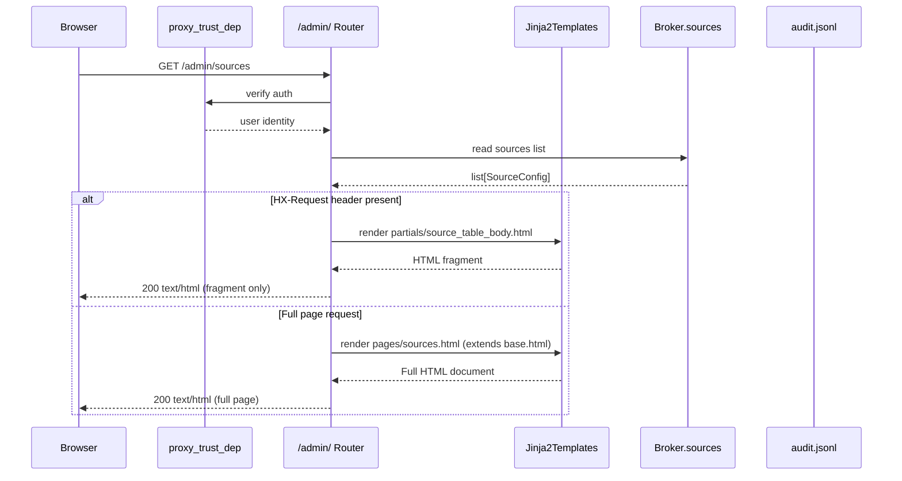
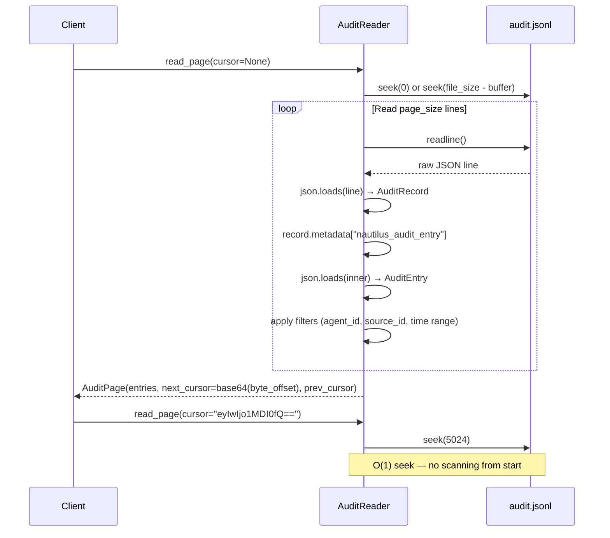
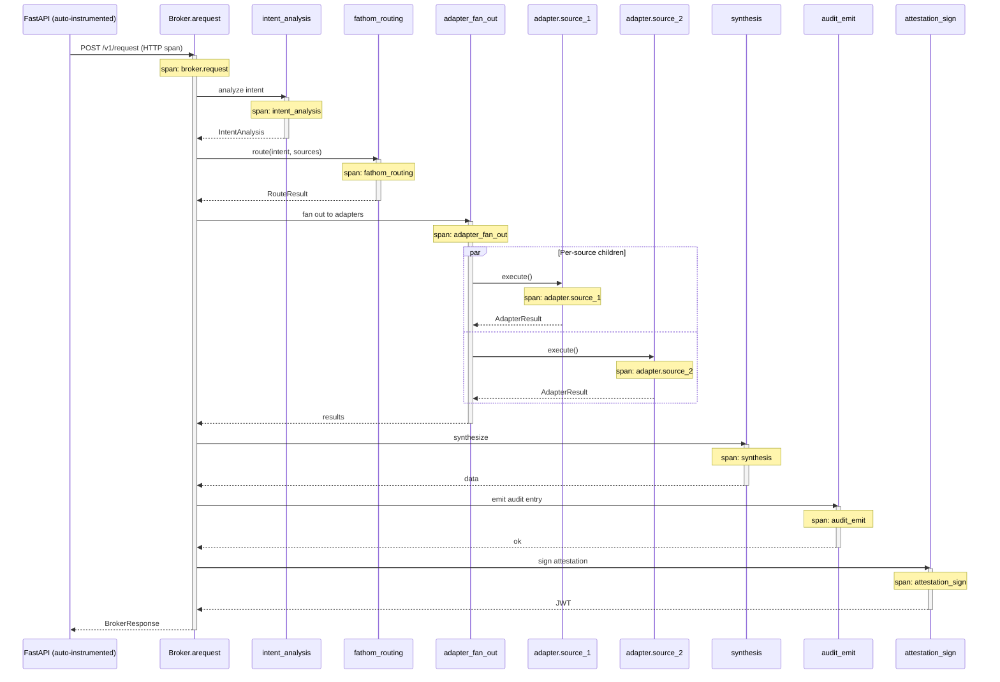
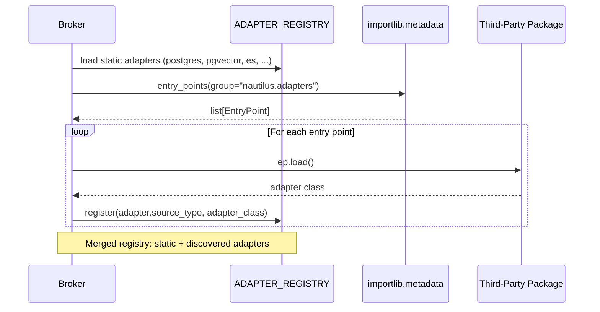

# Design: Operator Platform (Phase 4)

## Overview

The operator platform adds six additive workstreams atop the existing Nautilus broker with zero broker-side changes: a read-only HTMX + Jinja2 Admin UI mounted at `/admin/`, an OpenTelemetry observability module with Grafana dashboards, a standalone adapter SDK package, NIST SP 800-53 and HIPAA compliance rule packs, and two ecosystem adapters (InfluxDB, S3). All new code lives in isolated modules (`nautilus/ui/`, `nautilus/observability/`, `packages/nautilus-adapter-sdk/`, `rule-packs/`, `nautilus/adapters/{influxdb,s3}.py`) and integrates with the broker exclusively through existing public surfaces (`Broker.sources`, `audit.jsonl`, `AttestationService`, `proxy_trust_dependency`, `fathom.packs` entry points).

---

## Architecture

```mermaid
graph TB
    subgraph Existing["Existing Broker (unchanged)"]
        FApp["fastapi_app.py<br/>create_app()"]
        Broker["Broker"]
        FRouter["FathomRouter"]
        Audit["AuditLogger<br/>→ audit.jsonl"]
        Attest["AttestationService"]
        Auth["auth.py<br/>proxy_trust / api_key"]
        Adapters["Adapter Registry<br/>postgres, pgvector, es,<br/>neo4j, rest, servicenow"]
    end

    subgraph AdminUI["nautilus/ui/ (new)"]
        UIRouter["admin_router<br/>APIRouter /admin/"]
        Templates["Jinja2 templates<br/>pages/ + partials/"]
        Static["static/<br/>htmx.min.js, sse.js, styles.css"]
        AuditReader["audit_reader.py<br/>seek-based pagination"]
        SSE["sse.py<br/>source status stream"]
    end

    subgraph OTel["nautilus/observability/ (new)"]
        Instrument["instrumentation.py<br/>setup_otel()"]
        Spans["spans.py<br/>manual pipeline spans"]
        Metrics["metrics.py<br/>6 counters + 3 histograms"]
    end

    subgraph SDK["packages/nautilus-adapter-sdk/ (new)"]
        Proto["Protocol + Types"]
        Compliance["AdapterComplianceSuite"]
        Template["Copier template"]
        Docs["MkDocs site"]
    end

    subgraph Packs["rule-packs/ (new)"]
        NIST["data-routing-nist"]
        HIPAA["data-routing-hipaa"]
    end

    subgraph EcoAdapters["Ecosystem Adapters (new)"]
        Influx["InfluxDBAdapter"]
        S3["S3Adapter"]
    end

    subgraph Grafana["Observability Stack"]
        Dashboards["3 JSON dashboards"]
        Compose["docker-compose.otel.yml"]
        Bench["benchmarks/ (Locust)"]
    end

    FApp -->|mount| UIRouter
    UIRouter -->|depends| Auth
    UIRouter -->|reads| Broker
    UIRouter -->|reads| Audit
    UIRouter -->|calls| Attest
    AuditReader -->|seek reads| Audit
    SSE -->|watches| Broker

    OTel -.->|wraps| Broker
    OTel -.->|wraps| FApp
    Instrument -->|auto-instrument| FApp
    Spans -->|manual spans| Broker
    Metrics -->|emit| Broker

    Influx -->|implements| Proto
    S3 -->|implements| Proto
    Influx -->|registers| Adapters
    S3 -->|registers| Adapters

    NIST -->|fathom.packs| FRouter
    HIPAA -->|fathom.packs| FRouter

    Dashboards -->|visualizes| OTel
    Bench -->|loads| FApp
```



---

## Components

### A. Admin UI (`nautilus/ui/`)

**Purpose**: Read-only operator dashboard for inspecting sources, routing decisions, audit log, and attestation verification.

**Responsibilities**:
- Mount as `APIRouter` at `/admin/` on existing FastAPI app
- Gate all routes with existing `proxy_trust_dependency` / `require_api_key`
- Serve full pages (browser nav) and HTMX partials (HX-Request: true) from same endpoints
- Read `Broker.sources` and `audit.jsonl` — never write

**Module Structure**:
```
nautilus/ui/
├── __init__.py              # admin_router factory
├── router.py                # route definitions
├── dependencies.py          # shared deps (broker, auth, audit reader)
├── audit_reader.py          # seek-based JSONL pagination
├── sse.py                   # SSE source status endpoint
├── static/
│   ├── htmx.min.js          # vendored HTMX 2.0.x (~14KB gzip)
│   ├── htmx-ext-sse.min.js  # vendored SSE extension (~3KB)
│   └── styles.css           # custom CSS (~200 lines)
└── templates/
    ├── base.html             # root layout, nav, vendored JS/CSS refs
    ├── layouts/
    │   └── dashboard.html    # extends base, sidebar + content grid
    ├── pages/
    │   ├── sources.html      # US-1: source status dashboard
    │   ├── decisions.html    # US-2: routing decision table
    │   ├── audit.html        # US-3: audit log viewer
    │   └── attestation.html  # US-4: token verification form
    ├── partials/
    │   ├── source_card.html       # HTMX fragment: single source
    │   ├── source_table_body.html # HTMX fragment: full source tbody
    │   ├── decision_row.html      # HTMX fragment: decision table row
    │   ├── decision_detail.html   # HTMX fragment: modal with full trace
    │   ├── audit_rows.html        # HTMX fragment: audit tbody with pagination
    │   ├── audit_filters.html     # HTMX fragment: filter controls
    │   ├── attestation_result.html # HTMX fragment: verify result
    │   └── pagination.html        # reusable cursor pagination controls
    └── macros/
        └── table.html        # Jinja2 macros for table rendering
```

**Key Interfaces**:

```python
# nautilus/ui/__init__.py
from fastapi import APIRouter

def create_admin_router() -> APIRouter:
    """Build the /admin/ router with all views + SSE."""
    ...

# nautilus/ui/router.py
from fastapi import APIRouter, Request, Depends
from fastapi.responses import HTMLResponse

router = APIRouter(prefix="/admin", tags=["admin"])

@router.get("/sources", response_class=HTMLResponse)
async def sources_page(request: Request, user: str = Depends(auth_dep)) -> HTMLResponse:
    """Full page or HTMX partial based on HX-Request header."""
    ...

@router.get("/decisions", response_class=HTMLResponse)
async def decisions_page(
    request: Request,
    agent_id: str | None = None,
    start: str | None = None,
    end: str | None = None,
    outcome: str | None = None,
    search: str | None = None,
    user: str = Depends(auth_dep),
) -> HTMLResponse: ...

@router.get("/decisions/{request_id}", response_class=HTMLResponse)
async def decision_detail(request: Request, request_id: str, user: str = Depends(auth_dep)) -> HTMLResponse:
    """Modal fragment with rule_trace, routing_decisions, scope_constraints, denial_records."""
    ...

@router.get("/audit", response_class=HTMLResponse)
async def audit_page(
    request: Request,
    agent_id: str | None = None,
    source_id: str | None = None,
    event_type: str | None = None,
    start: str | None = None,
    end: str | None = None,
    cursor: str | None = None,      # base64-encoded byte offset
    sort: str = "timestamp_desc",
    user: str = Depends(auth_dep),
) -> HTMLResponse: ...

@router.get("/attestation", response_class=HTMLResponse)
async def attestation_page(request: Request, user: str = Depends(auth_dep)) -> HTMLResponse: ...

@router.post("/attestation/verify", response_class=HTMLResponse)
async def attestation_verify(request: Request, token: str = Form(...), user: str = Depends(auth_dep)) -> HTMLResponse:
    """Semantically read-only: verifies JWT signature, never writes state."""
    ...
```

```python
# nautilus/ui/audit_reader.py
from dataclasses import dataclass
from nautilus.core.models import AuditEntry

@dataclass(frozen=True)
class AuditPage:
    entries: list[AuditEntry]
    next_cursor: str | None     # base64(byte_offset) or None if last page
    prev_cursor: str | None
    total_estimate: int | None  # file_size / avg_line_size (approximate)

class AuditReader:
    """Seek-based JSONL reader with byte-offset cursors.

    Opens audit.jsonl, seeks to cursor position, reads page_size lines,
    applies filters in-memory, records byte offset of next unread line.
    """

    def __init__(self, audit_path: str, page_size: int = 50) -> None: ...

    def read_page(
        self,
        cursor: str | None = None,
        agent_id: str | None = None,
        source_id: str | None = None,
        event_type: str | None = None,
        start: str | None = None,
        end: str | None = None,
        sort: str = "timestamp_desc",
    ) -> AuditPage:
        """Read one page from audit.jsonl starting at cursor byte offset.

        Double-parse: reads raw JSON line → AuditRecord → extracts
        metadata["nautilus_audit_entry"] → AuditEntry.

        For descending sort (default): seeks backwards from EOF or cursor.
        """
        ...

    @staticmethod
    def _decode_cursor(cursor: str) -> int:
        """base64 → byte offset integer."""
        ...

    @staticmethod
    def _encode_cursor(offset: int) -> str:
        """byte offset → base64 string."""
        ...
```

```python
# nautilus/ui/sse.py
from sse_starlette.sse import EventSourceResponse

@router.get("/sources/events")
async def source_events(request: Request, user: str = Depends(auth_dep)) -> EventSourceResponse:
    """SSE stream pushing source health changes. Clients subscribe via hx-ext='sse'."""
    ...
```

**Integration Points**:
- `fastapi_app.py::create_app()` — add `app.include_router(create_admin_router())` after existing route registration
- `Broker.sources` — read-only access via `request.app.state.broker.sources`
- `audit.jsonl` path from `NautilusConfig.audit.path` (available via `broker._config.audit.path`)
- `AttestationService` — reuse broker's instance for JWT verification
- `auth.py` — reuse `proxy_trust_dependency` / `require_api_key` as route dependency

**Security Invariant**: `SourceConfig.connection` is NEVER passed to templates. Only `id`, `type`, `classification`, `data_types`, `allowed_purposes`, `description` are rendered (mirroring existing `GET /v1/sources` pattern).

---

### B. Observability (`nautilus/observability/`)

**Purpose**: Optional OTel instrumentation (traces + metrics) with Grafana dashboard provisioning.

**Responsibilities**:
- Auto-instrument FastAPI HTTP layer (excluding `/healthz`, `/readyz`)
- Create manual spans for broker pipeline stages
- Emit 6 counters + 3 histograms
- All imports guarded by `try/except ImportError` — no-op when `nautilus[otel]` not installed
- Respect `OTEL_SDK_DISABLED=true`

**Module Structure**:
```
nautilus/observability/
├── __init__.py              # setup_otel() entrypoint + no-op guards
├── instrumentation.py       # FastAPI auto-instrumentation setup
├── spans.py                 # manual span context managers
├── metrics.py               # counter + histogram definitions
└── _noop.py                 # no-op stubs when OTel unavailable
```

**Key Interfaces**:

```python
# nautilus/observability/__init__.py
def setup_otel(app: FastAPI, service_name: str = "nautilus") -> None:
    """Initialize OTel if available. No-op if imports fail or OTEL_SDK_DISABLED=true."""
    try:
        from nautilus.observability.instrumentation import _setup
        _setup(app, service_name)
    except ImportError:
        pass  # nautilus[otel] not installed — silent no-op

# nautilus/observability/spans.py
from contextlib import contextmanager
from typing import Generator

@contextmanager
def broker_span(name: str, attributes: dict[str, str] | None = None) -> Generator[None, None, None]:
    """Create a manual OTel span. No-op if OTel unavailable."""
    ...

# Span hierarchy for a broker request:
# broker.request (root)
#   ├── intent_analysis
#   ├── fathom_routing
#   ├── adapter_fan_out
#   │   ├── adapter.{source_id} (per-source)
#   │   └── adapter.{source_id}
#   ├── synthesis
#   ├── audit_emit
#   └── attestation_sign

# nautilus/observability/metrics.py
class NautilusMetrics:
    """Lazy-initialized OTel metric instruments. No-op attributes when OTel absent."""

    # Counters
    requests_total: Counter           # nautilus.requests.total
    routing_decisions_total: Counter   # nautilus.routing.decisions.total {source, action}
    scope_denials_total: Counter       # nautilus.scope.denials.total {source, reason}
    attestation_total: Counter         # nautilus.attestation.total {status}
    adapter_errors_total: Counter      # nautilus.adapter.errors.total {type, source}
    exposure_flags_total: Counter      # nautilus.session.exposure_flags.total

    # Histograms
    request_duration: Histogram        # nautilus.request.duration (ms)
    adapter_latency: Histogram         # nautilus.adapter.latency (ms) {source}
    fathom_eval_duration: Histogram    # nautilus.fathom.evaluation.duration (ms)
```

**Integration Points**:
- `fastapi_app.py::create_app()` — call `setup_otel(app)` during lifespan startup
- `Broker.arequest()` — instrument with `broker_span()` calls around each pipeline stage
- `pyproject.toml` — add `[project.optional-dependencies] otel = [...]`

**OTel Import Guard Pattern** (used everywhere in this module):

```python
try:
    from opentelemetry import trace
    from opentelemetry.metrics import get_meter
    _OTEL_AVAILABLE = True
except ImportError:
    _OTEL_AVAILABLE = False
```

---

### C. Grafana Stack (`observability/grafana/`)

**Purpose**: Pre-built dashboards + docker-compose for turnkey observability.

**Module Structure**:
```
observability/
├── grafana/
│   ├── dashboards/
│   │   ├── overview.json         # request rate, decision distribution, error rate
│   │   ├── adapters.json         # per-adapter latency, error breakdown
│   │   └── attestation.json      # attestation success/failure, verification latency
│   └── provisioning/
│       ├── datasources.yml       # Tempo, Prometheus, Loki with cross-links
│       └── dashboards.yml        # auto-provision from dashboards/
├── docker-compose.otel.yml       # Grafana + Tempo + Prometheus + Loki
├── prometheus.yml                # scrape config for /metrics
└── otel-collector-config.yml     # optional OTel Collector overlay
```

**Dashboard Schema**: Raw JSON (not grafanalib — incompatible with Python 3.14). Each dashboard follows Grafana's `dashboard.json` schema with templated datasource UIDs using Grafana's provisioning variable substitution.

---

### D. Benchmarking (`benchmarks/`)

**Purpose**: Locust-based load harness with OTel correlation and JSON report output.

**Module Structure**:
```
benchmarks/
├── locustfile.py            # Locust task set hitting /v1/request
├── conftest.py              # fixtures for report generation
├── report.py                # JSON report builder (p50/p95/p99, throughput, error rate)
├── Dockerfile.bench         # reproducible Dockerized benchmark
└── README.md
```

**Key Interface**:

```python
# benchmarks/locustfile.py
from locust import HttpUser, task, between

class NautilusBenchUser(HttpUser):
    wait_time = between(0.1, 0.5)

    @task
    def broker_request(self) -> None:
        self.client.post("/v1/request", json={
            "agent_id": "bench-agent",
            "intent": "test query",
            "context": {}
        }, headers={"X-API-Key": self.environment.parsed_options.api_key})
```

---

### E. Adapter SDK (`packages/nautilus-adapter-sdk/`)

**Purpose**: Standalone PyPI package enabling third-party adapter development without Nautilus dependency.

**Module Structure**:
```
packages/nautilus-adapter-sdk/
├── pyproject.toml               # pydantic>=2.0 sole dep, Python >=3.11
├── py.typed                     # PEP 561 marker
├── src/
│   └── nautilus_adapter_sdk/
│       ├── __init__.py          # re-exports all public API
│       ├── protocols.py         # Adapter Protocol, Embedder Protocol
│       ├── types.py             # Pydantic models (mirrored from nautilus.core.models)
│       ├── config.py            # SourceConfig (type: str, not Literal union)
│       ├── exceptions.py        # AdapterError, ScopeEnforcementError
│       ├── scope.py             # validate_operator, validate_field, render_field
│       ├── testing/
│       │   ├── __init__.py
│       │   └── compliance.py    # AdapterComplianceSuite
│       └── py.typed
├── tests/
│   └── test_types.py            # structural equivalence checks
└── README.md
```

**Key Interfaces**:

```python
# nautilus_adapter_sdk/protocols.py
from typing import Any, ClassVar, Protocol, runtime_checkable
from nautilus_adapter_sdk.types import AdapterResult, IntentAnalysis, ScopeConstraint
from nautilus_adapter_sdk.config import SourceConfig

@runtime_checkable
class Adapter(Protocol):
    source_type: ClassVar[str]
    async def connect(self, config: SourceConfig) -> None: ...
    async def execute(self, intent: IntentAnalysis, scope: list[ScopeConstraint], context: dict[str, Any]) -> AdapterResult: ...
    async def close(self) -> None: ...

@runtime_checkable
class Embedder(Protocol):
    def embed(self, text: str) -> list[float]: ...

# nautilus_adapter_sdk/config.py
class SourceConfig(BaseModel):
    id: str
    type: str                    # str, NOT Literal union — third-party adapters use arbitrary names
    description: str
    classification: str
    data_types: list[str]
    allowed_purposes: list[str] | None = None
    connection: str
    # Extension fields as **kwargs via model_config extra="allow"

# nautilus_adapter_sdk/testing/compliance.py
import pytest

class AdapterComplianceSuite:
    """Run against any Adapter implementation to verify Protocol contract.

    Usage:
        class TestMyAdapter(AdapterComplianceSuite):
            @pytest.fixture
            def adapter(self) -> MyAdapter:
                return MyAdapter()

            @pytest.fixture
            def source_config(self) -> SourceConfig:
                return SourceConfig(...)
    """

    def test_connect_execute_close_lifecycle(self, adapter, source_config): ...
    def test_scope_enforcement_valid_operator(self, adapter, source_config): ...
    def test_scope_enforcement_invalid_operator(self, adapter, source_config): ...
    def test_idempotent_close(self, adapter, source_config): ...
    def test_error_path_returns_error_record(self, adapter, source_config): ...
```

**Plugin Discovery**: Third-party adapters register via `pyproject.toml`:

```toml
[project.entry-points."nautilus.adapters"]
my_adapter = "my_package:MyAdapter"
```

Broker discovers at startup via `importlib.metadata.entry_points(group="nautilus.adapters")`, merging with static `ADAPTER_REGISTRY`.

**Drift Guard**: CI test in `tests/test_sdk_drift.py` (Nautilus repo) compares SDK type signatures against internal types using `inspect.signature()` + `pydantic` schema comparison. Fails if any public field/method diverges.

---

### F. Compliance Rule Packs (`rule-packs/`)

**Purpose**: NIST SP 800-53 and HIPAA compliance rules for Nautilus routing. Fresh rules against Nautilus templates (Fathom built-in packs are incompatible).

**Module Structure**:
```
rule-packs/
├── data-routing-nist/
│   ├── templates/
│   │   └── nist_control.yaml         # template: nist_control_mapping
│   ├── modules/
│   │   └── nist-routing.yaml         # module definition
│   ├── rules/
│   │   ├── ac-3-access-enforcement.yaml   # denial rules (salience 170-190)
│   │   ├── ac-4-information-flow.yaml     # primary flow control rules
│   │   ├── ac-6-least-privilege.yaml      # scope constraint rules (130-150)
│   │   ├── ac-16-security-attributes.yaml
│   │   ├── ac-21-information-sharing.yaml
│   │   ├── ac-23-data-mining.yaml
│   │   ├── sc-7-boundary-protection.yaml
│   │   └── sc-16-transmission-integrity.yaml
│   ├── hierarchies/
│   │   └── cui-sub-extended.yaml     # extends CUI: +ITAR, +EAR, +FTI, +LES
│   ├── README.md                     # compliance disclaimer
│   └── pack.yaml                     # pack metadata
├── data-routing-hipaa/
│   ├── templates/
│   │   └── phi_classification.yaml   # template: phi_source_tag
│   ├── modules/
│   │   └── hipaa-routing.yaml        # module definition
│   ├── rules/
│   │   ├── minimum-necessary.yaml    # scope constraints per purpose (130-150)
│   │   ├── phi-access-control.yaml   # denial rules for unauthorized PHI (170-190)
│   │   ├── phi-hierarchy.yaml        # de-identified < limited < standard < sensitive
│   │   ├── breach-detection.yaml     # temporal operator rules (110-120)
│   │   └── role-restrictions.yaml    # purpose-based role restrictions
│   ├── hierarchies/
│   │   └── phi-level.yaml            # PHI sensitivity hierarchy
│   ├── README.md                     # compliance disclaimer
│   └── pack.yaml                     # pack metadata
```

**Salience Bands**:

| Band | Range | Purpose | Examples |
|------|-------|---------|----------|
| Compliance denials | 170-190 | Hard blocks | CUI access without clearance, PHI without role authorization |
| Scope constraints | 130-150 | Field/row restrictions | Minimum necessary field filtering, time range limits |
| Escalations | 110-120 | Alerts/escalations | Breach detection temporal patterns, cumulative exposure |

**CUI Extended Hierarchy** (`cui-sub-extended.yaml`):
```yaml
name: cui-sub
levels:
  - cui
  - cui-sp-cti
  - cui-sp-iih
  - cui-sp-pciip
  - cui-sp-itar    # new
  - cui-sp-ear     # new
  - cui-sp-fti     # new
  - cui-sp-les     # new
```

**PHI Hierarchy** (`phi-level.yaml`):
```yaml
name: phi-level
levels:
  - de-identified
  - limited
  - standard
  - sensitive         # mental health, substance abuse, HIV
```

**Registration** (`pyproject.toml`):
```toml
[project.entry-points."fathom.packs"]
data-routing-nist = "rule_packs.data_routing_nist"
data-routing-hipaa = "rule_packs.data_routing_hipaa"
```

**Disclaimer** (in every pack README and `pack.yaml`):
> Reference implementation only -- not certified for production compliance. Organizations must validate rules against their specific regulatory requirements and engage qualified compliance personnel.

---

### G. Ecosystem Adapters

#### InfluxDB Adapter (`nautilus/adapters/influxdb.py`)

```python
class InfluxDBAdapter:
    source_type: ClassVar[str] = "influxdb"

    async def connect(self, config: SourceConfig) -> None:
        """Initialize async InfluxDB v2 client via influxdb-client-python."""
        ...

    async def execute(
        self, intent: IntentAnalysis, scope: list[ScopeConstraint], context: dict[str, Any]
    ) -> AdapterResult:
        """Build Flux query with scope constraints mapped to:
        - measurement filtering: |> filter(fn: (r) => r._measurement == "...")
        - tag restrictions: |> filter(fn: (r) => r.tag_key == "tag_value")
        - time range: |> range(start: ..., stop: ...)
        """
        ...

    async def close(self) -> None:
        """Release HTTP client. Idempotent."""
        ...
```

**Scope Mapping**:

| ScopeConstraint field | Flux equivalent |
|----|-----|
| `_measurement` with `=` | `filter(fn: (r) => r._measurement == value)` |
| `_measurement` with `IN` | `filter(fn: (r) => contains(value: r._measurement, set: [...]))` |
| tag key with `=` / `!=` | `filter(fn: (r) => r.{tag} == value)` |
| `_time` with `>=` / `<=` | `range(start: ..., stop: ...)` |

#### S3 Adapter (`nautilus/adapters/s3.py`)

```python
class S3Adapter:
    source_type: ClassVar[str] = "s3"

    async def connect(self, config: SourceConfig) -> None:
        """Initialize aiobotocore S3 session. Supports endpoint_url for S3-compatible stores."""
        ...

    async def execute(
        self, intent: IntentAnalysis, scope: list[ScopeConstraint], context: dict[str, Any]
    ) -> AdapterResult:
        """List/get objects with scope constraints mapped to:
        - prefix restrictions: Prefix= parameter on list_objects_v2
        - tag filtering: post-filter via get_object_tagging
        - classification labels: match object metadata x-amz-meta-classification
        """
        ...

    async def close(self) -> None:
        """Release aiobotocore session. Idempotent."""
        ...
```

Both adapters registered in `ADAPTER_REGISTRY` (existing dict in broker) and discoverable via `nautilus.adapters` entry points.

---

### H. Adapter Scaffold (`templates/adapter/`)

Copier template generating a complete adapter project:

```
templates/adapter/
├── copier.yml                    # template config + questions
├── {{project_name}}/
│   ├── pyproject.toml.jinja      # entry point, SDK dep
│   ├── src/
│   │   └── {{module_name}}/
│   │       ├── __init__.py.jinja
│   │       └── adapter.py.jinja  # Protocol implementation stub
│   ├── tests/
│   │   └── test_compliance.py.jinja  # wires AdapterComplianceSuite
│   ├── .github/
│   │   └── workflows/
│   │       └── ci.yml.jinja      # lint + type check + compliance suite
│   └── README.md.jinja
```

### I. SDK Documentation (`docs/sdk/`)

```
docs/sdk/
├── mkdocs.yml                    # Material theme config
├── docs/
│   ├── index.md
│   ├── tutorial.md               # "Write Your First Adapter" walkthrough
│   ├── reference/
│   │   ├── protocol.md           # auto-generated via mkdocstrings
│   │   ├── types.md
│   │   └── testing.md
│   └── discovery.md              # Entry point registration guide
```

---

## Data Flow

### Admin UI Request (Full Page vs HTMX Partial)



### Audit JSONL Seek-Based Pagination



### OTel Span Hierarchy for Broker Request



### Adapter SDK Plugin Discovery



---

## Technical Decisions

| Decision | Options Considered | Choice | Rationale |
|----------|-------------------|--------|-----------|
| Admin UI tech | React+Vite, HTMX+Jinja2, Svelte | HTMX+Jinja2 | Air-gap: 17KB vendored JS vs ~150KB+ for React. No build pipeline. Jinja2 already a FastAPI transitive dep. |
| Admin UI mount | Separate FastAPI app, Sub-application, APIRouter | APIRouter on existing app | Shares lifespan, broker instance, and auth deps. No cross-process complexity. |
| SDK repo layout | Separate repository, Monorepo workspace | Monorepo (`packages/`) | Drift-guard CI simplified — same repo runs structural equivalence. `copier update` for template evolution stays in-tree. |
| OTel module location | Inline in broker.py, Middleware, Dedicated module | Dedicated `nautilus/observability/` | Clean separation. Import guards isolated to one package. Broker stays unchanged when OTel absent. |
| OTel dependency | Always required, Optional extras | Optional `nautilus[otel]` | Air-gap: base install has no OTel dep. `OTEL_SDK_DISABLED=true` for no-op. |
| Audit pagination | Line counting, SQLite index, Seek-based cursors | Seek-based byte-offset cursors | O(1) page access on GB files. No external index to maintain. No additional dependency. |
| CSS approach | Pico CSS, Tailwind, Custom CSS | Custom `styles.css` (~200 lines) | Smallest footprint. No CDN. No build pipeline. Air-gap trivial. Pico adds 10KB for marginal polish. |
| Dashboard tooling | grafanalib, Grafonnet, Raw JSON | Raw JSON | grafanalib incompatible with Python 3.14. Raw JSON is universal, versioned, and import-free. |
| Compliance pack format | Python code, YAML rules | YAML rules (Fathom packs) | Matches existing `fathom.packs` pattern. Operator-readable. No code execution for compliance rules. |
| `SourceConfig.type` in SDK | `Literal` union, `str` | `str` | Third-party adapters declare arbitrary type names. `Literal` union would require SDK release for every new type. |
| Deployment strategy | Feature flags per workstream, Big-bang | Big-bang release | All workstreams are additive. No broker changes. No need for gradual rollout. |
| Real-time updates | WebSocket, SSE, Polling | SSE (source status), Polling (audit) | SSE via `sse-starlette` is push-efficient for health status. Audit log is search-oriented, not watch-oriented — polling/manual refresh fits the UX. |
| InfluxDB version | v1 (InfluxQL) + v2 (Flux), v2 only | v2+ (Flux) only | v1 is legacy. `influxdb-client-python` targets v2 API. Simplifies scope mapping to Flux-native filters. |
| S3 compatibility | AWS-only, S3-compatible stores | S3-compatible via `endpoint_url` | `aiobotocore` supports arbitrary endpoints. Document MinIO/Ceph/R2 compatibility. Zero code difference. |
| Embedder in SDK | Include, Exclude | Include (Protocol only) | Protocol is stable (1 implementation + NoopEmbedder). No concrete implementations shipped in SDK. |

---

## Unresolved Questions Resolution

| ID | Question | Resolution | Rationale |
|----|----------|------------|-----------|
| UQ-1 | Audit file rotation | **Defer to Phase 5**. Seek-based pagination handles GB files (NFR-4: <200ms page load on 1GB). Log rotation would require multi-file spanning logic — unnecessary complexity now. | Seek pagination is the immediate fix; rotation is operational concern solvable with external logrotate. |
| UQ-2 | Admin UI base path | **Fixed `/admin/`**. Not configurable. | Bookmarkable URLs. Simpler routing. No use case presented for multiple admin mounts. |
| UQ-3 | SDK repo layout | **Monorepo** under `packages/nautilus-adapter-sdk/`. | Drift-guard test runs in same CI. Shared branch/release cycle. Third-party "feel" preserved via separate `pyproject.toml`. |
| UQ-4 | OTel trace_id in audit | **Yes, add as optional field** `trace_id: str | None = None` on `AuditEntry`. Default `None` preserves backward compat (NFR-5). Populated when OTel is active. | Enables Loki-to-Tempo drill-down. Single optional field is minimal broker change. |
| UQ-5 | CSS approach | **Custom `styles.css`** (~200 lines). | Smallest footprint, zero CDN, zero build pipeline. Sufficient for read-only dashboard with tables + modals. |
| UQ-6 | InfluxDB version | **v2+ only** (Flux query language). | `influxdb-client-python` targets v2 API. v1 is EOL. |
| UQ-7 | S3-compatible stores | **Document S3-compatible support** via `endpoint_url` in `SourceConfig.connection`. Test with MinIO via testcontainers. | `aiobotocore` handles this natively. Document MinIO, Ceph, Cloudflare R2. |
| UQ-8 | Embedder Protocol in SDK | **Include** the Protocol definition. Exclude concrete implementations. | Protocol surface is stable (2 files: protocol + NoopEmbedder). SDK ships the `Protocol` class only — no implementation debt. |

---

## File Structure

### New Files

| File | Purpose |
|------|---------|
| `nautilus/ui/__init__.py` | `create_admin_router()` factory |
| `nautilus/ui/router.py` | All admin route handlers |
| `nautilus/ui/dependencies.py` | Shared deps: broker access, auth, audit reader |
| `nautilus/ui/audit_reader.py` | Seek-based JSONL pagination |
| `nautilus/ui/sse.py` | SSE source status endpoint |
| `nautilus/ui/static/htmx.min.js` | Vendored HTMX 2.0.x |
| `nautilus/ui/static/htmx-ext-sse.min.js` | Vendored SSE extension |
| `nautilus/ui/static/styles.css` | Custom CSS |
| `nautilus/ui/templates/base.html` | Root layout |
| `nautilus/ui/templates/layouts/dashboard.html` | Dashboard layout |
| `nautilus/ui/templates/pages/sources.html` | Source status page |
| `nautilus/ui/templates/pages/decisions.html` | Routing decisions page |
| `nautilus/ui/templates/pages/audit.html` | Audit log page |
| `nautilus/ui/templates/pages/attestation.html` | Attestation verify page |
| `nautilus/ui/templates/partials/source_table_body.html` | Source table HTMX fragment |
| `nautilus/ui/templates/partials/decision_row.html` | Decision row fragment |
| `nautilus/ui/templates/partials/decision_detail.html` | Decision modal fragment |
| `nautilus/ui/templates/partials/audit_rows.html` | Audit table fragment |
| `nautilus/ui/templates/partials/audit_filters.html` | Audit filter controls |
| `nautilus/ui/templates/partials/attestation_result.html` | Verify result fragment |
| `nautilus/ui/templates/partials/pagination.html` | Cursor pagination controls |
| `nautilus/ui/templates/macros/table.html` | Reusable table macros |
| `nautilus/observability/__init__.py` | `setup_otel()` with import guards |
| `nautilus/observability/instrumentation.py` | FastAPI auto-instrumentation |
| `nautilus/observability/spans.py` | Manual span context managers |
| `nautilus/observability/metrics.py` | Counter + histogram definitions |
| `nautilus/observability/_noop.py` | No-op stubs |
| `nautilus/adapters/influxdb.py` | InfluxDB adapter |
| `nautilus/adapters/s3.py` | S3 adapter |
| `packages/nautilus-adapter-sdk/pyproject.toml` | SDK package config |
| `packages/nautilus-adapter-sdk/src/nautilus_adapter_sdk/__init__.py` | Public API re-exports |
| `packages/nautilus-adapter-sdk/src/nautilus_adapter_sdk/protocols.py` | Adapter + Embedder protocols |
| `packages/nautilus-adapter-sdk/src/nautilus_adapter_sdk/types.py` | Pydantic models |
| `packages/nautilus-adapter-sdk/src/nautilus_adapter_sdk/config.py` | SourceConfig (type: str) |
| `packages/nautilus-adapter-sdk/src/nautilus_adapter_sdk/exceptions.py` | Exception hierarchy |
| `packages/nautilus-adapter-sdk/src/nautilus_adapter_sdk/scope.py` | Scope validators |
| `packages/nautilus-adapter-sdk/src/nautilus_adapter_sdk/testing/__init__.py` | Testing module |
| `packages/nautilus-adapter-sdk/src/nautilus_adapter_sdk/testing/compliance.py` | AdapterComplianceSuite |
| `rule-packs/data-routing-nist/` | NIST rule pack (templates, modules, rules, hierarchies) |
| `rule-packs/data-routing-hipaa/` | HIPAA rule pack (templates, modules, rules, hierarchies) |
| `observability/grafana/dashboards/overview.json` | Grafana overview dashboard |
| `observability/grafana/dashboards/adapters.json` | Grafana adapters dashboard |
| `observability/grafana/dashboards/attestation.json` | Grafana attestation dashboard |
| `observability/grafana/provisioning/datasources.yml` | Grafana datasource provisioning |
| `observability/grafana/provisioning/dashboards.yml` | Grafana dashboard provisioning |
| `observability/docker-compose.otel.yml` | OTel observability stack |
| `observability/prometheus.yml` | Prometheus scrape config |
| `benchmarks/locustfile.py` | Locust load harness |
| `benchmarks/report.py` | JSON report builder |
| `benchmarks/Dockerfile.bench` | Benchmark Docker image |
| `templates/adapter/copier.yml` | Copier template config |
| `templates/adapter/{{project_name}}/` | Generated adapter scaffold |
| `docs/sdk/mkdocs.yml` | SDK docs config |
| `docs/sdk/docs/tutorial.md` | "Write Your First Adapter" tutorial |
| `docs/sdk/docs/reference/` | API reference (auto-generated) |
| `tests/test_sdk_drift.py` | SDK structural equivalence CI test |

### Modified Files

| File | Change |
|------|--------|
| `nautilus/transport/fastapi_app.py` | Add `app.include_router(create_admin_router())` + `setup_otel(app)` in lifespan. Add `Jinja2Templates` mount + static file mount. |
| `nautilus/core/models.py` | Add optional `trace_id: str \| None = None` to `AuditEntry` (UQ-4). |
| `nautilus/core/broker.py` | Add OTel span calls around pipeline stages (guarded by import check). Add entry-point adapter discovery. Register InfluxDB + S3 in ADAPTER_REGISTRY. |
| `pyproject.toml` | Add `otel` optional dep group. Add `sse-starlette`, `python-multipart` to deps. Add `influxdb-client`, `aiobotocore` to deps. Add `fathom.packs` + `nautilus.adapters` entry points. Add package-data for `nautilus.ui`. Add dev deps: `locust`, `mkdocs`, `copier`. |

---

## Error Handling

| Component | Error Scenario | Strategy | User Impact |
|-----------|----------------|----------|-------------|
| Admin UI | `audit.jsonl` not found | Return empty table with "No audit data" message | Page renders, empty state shown |
| Admin UI | Corrupt JSONL line | Skip line, log warning, continue pagination | Missing row; operator sees gap |
| Admin UI | Invalid cursor (tampered base64) | Reset to first page, flash "Invalid cursor" | Redirected to page 1 |
| Admin UI | Auth failure | HTTP 401 (existing auth dep) | Standard 401 response |
| Admin UI | Broker not ready | HTTP 503 with "Broker starting..." template | Operator waits for startup |
| OTel | `nautilus[otel]` not installed | Silent no-op via `try/except ImportError` | No traces/metrics — expected in air-gap |
| OTel | `OTEL_SDK_DISABLED=true` | OTel SDK discards all spans/metrics | No observability — operator's choice |
| OTel | OTLP exporter unreachable | OTel SDK handles internally (retries, then drops) | Gaps in traces — no broker impact |
| Audit Reader | File too large for time-range filter | Scan stops at `page_size * 10` lines without match, return partial result + warning | Operator narrows filter or uses cursor |
| InfluxDB Adapter | Connection timeout | `AdapterError` → `sources_errored` | Error in BrokerResponse |
| InfluxDB Adapter | Invalid Flux query from scope | `ScopeEnforcementError` → `sources_errored` | Scope violation reported |
| S3 Adapter | Access denied (IAM) | `AdapterError` → `sources_errored` | Error in BrokerResponse |
| S3 Adapter | Object not found | Empty result set, no error | Empty data for source |
| Rule Packs | Pack validation failure | `Engine.load_pack()` raises — broker fails to start | Operator fixes pack YAML |
| SDK | Type drift detected | CI test fails — blocks release | Developer fixes divergence |
| Attestation verify | Invalid JWT | Return "invalid" fragment with error detail | Operator sees clear invalid state |
| Attestation verify | No signing key configured | Return "Attestation not configured" message | Clear feedback |

---

## Edge Cases

- **Empty `audit.jsonl`**: AuditReader returns `AuditPage(entries=[], next_cursor=None)`. UI shows "No audit entries" state.
- **Single-line `audit.jsonl`**: Pagination cursor logic handles file with one line — `next_cursor=None` after first read.
- **Concurrent audit writes during read**: AuditReader opens file in read-only mode. Concurrent appends extend EOF. Reader's seek position is stable — worst case: page fetched just before a write misses the newest line. Acceptable for read-only UI.
- **HTMX disabled (JS off)**: All pages work via standard form submission + full page reload (AC-1.4). Hidden inputs carry filter state. No HTMX-only functionality.
- **Multiple browser tabs with SSE**: Each tab opens its own SSE connection. Server-side generator is lightweight (reads broker state, yields events). Acceptable up to ~50 concurrent tabs.
- **SDK type with `extra="allow"`**: Third-party `SourceConfig` subclasses can add fields without breaking validation. SDK `SourceConfig` uses `model_config = ConfigDict(extra="allow")`.
- **Rule pack with conflicting salience**: Both NIST and HIPAA packs use the same salience bands. Rules within a band fire in declaration order. Packs are designed to be loaded independently or together — no cross-pack rule conflicts.
- **OTel + air-gap**: `OTEL_SDK_DISABLED=true` makes OTel SDK no-op. Spans created but immediately discarded. Zero network calls. Zero overhead beyond function call.
- **Attestation verify POST is semantically read-only**: The POST method is used for form submission. No state mutation occurs. NFR-7 is satisfied.

---

## Test Strategy

### Unit Tests

| Target | Test | Mock |
|--------|------|------|
| `AuditReader.read_page()` | 200-line JSONL, paginate in 4 pages, verify cursor round-trip | Fixture JSONL file |
| `AuditReader` filters | Combined agent_id + source_id + time range → correct subset | Fixture JSONL |
| `AuditReader` double-parse | Raw AuditRecord JSONL → AuditEntry extracted correctly | None |
| Admin route `/admin/sources` | Full page vs HTMX partial (HX-Request header) | Mock broker with 3 sources |
| Admin route `/admin/decisions/{id}` | Modal fragment contains rule_trace, denial_records | Mock AuditEntry |
| Attestation verify | Valid token → "valid"; tampered → "invalid"; no key → "not configured" | Mock AttestationService |
| `NautilusMetrics` | After one broker request, all 9 metrics non-zero | OTel test SDK |
| Span hierarchy | Mock tracer captures expected parent-child span structure | OTel mock tracer |
| InfluxDB scope mapping | ScopeConstraint → Flux filter fragments | None (pure logic) |
| S3 scope mapping | ScopeConstraint → prefix/tag/classification filters | None (pure logic) |
| SDK types structural equivalence | Compare SDK types to Nautilus internal types | None (reflection) |
| NIST rules | CUI source + insufficient clearance → denial with AC-3 rule | Fathom Engine test fixture |
| HIPAA rules | PHI source + operations purpose → minimum necessary scope constraints | Fathom Engine test fixture |

### Integration Tests

| Target | Test | Infrastructure |
|--------|------|---------------|
| Admin UI auth | Request without auth header → 401 | TestClient |
| Admin UI full flow | `GET /admin/sources` → 200 with source data rendered | TestClient + mock broker |
| OTel span collection | Broker request → OTel collector receives expected spans | OTel in-memory exporter |
| InfluxDB adapter | Scoped query returns matching measurements/tags/time window | testcontainers InfluxDB |
| S3 adapter | Scoped listing returns matching objects by prefix/tag/classification | testcontainers MinIO |
| Rule pack loading | `Engine.load_pack("data-routing-nist")` succeeds | Fathom Engine |
| Audit pagination perf | Seek-based cursor on 1GB JSONL < 200ms per page | Synthetic JSONL file |

### Benchmark Tests

| Target | Method | Metric |
|--------|--------|--------|
| OTel overhead | p95 latency with/without OTel | < 3% increase (NFR-5) |
| Audit page load | 1GB JSONL seek-based pagination | < 200ms (NFR-4) |
| UI render time | `/admin/sources` server-side render | < 100ms (NFR-6) |
| Locust harness | 10s load test | JSON report with p50/p95/p99 |

---

## Performance Considerations

- **Audit pagination**: Seek-based cursors give O(1) page access regardless of file size. No index to build or maintain. Trade-off: filters require in-memory scan of `page_size * overscan_factor` lines.
- **SSE connections**: One SSE connection per browser tab. Server generator yields events lazily. No persistent state between events. Acceptable for operator-scale (not agent-scale) traffic.
- **OTel overhead**: Target < 3% p95 latency increase. OTel SDK batches exports asynchronously. Span creation is ~1us. Import guards ensure zero overhead when disabled.
- **Template rendering**: Jinja2 compiled templates cached after first render. Target < 100ms server-side for source status page. HTMX partials are smaller, faster.
- **InfluxDB adapter**: Async HTTP client pools connections. Flux queries pushed to InfluxDB server — no client-side data processing beyond deserialization.
- **S3 adapter**: `aiobotocore` uses async HTTP. Object listing paginated server-side via `ContinuationToken`. Tag filtering is post-filter (S3 API limitation) but scoped by prefix first.

---

## Security Considerations

- **Read-only invariant**: Admin UI has zero write endpoints. `POST /admin/attestation/verify` is semantically read-only (verifies, doesn't mutate). Static audit: no endpoint calls `broker.arequest()`, session store writes, or file writes.
- **Credential suppression**: `SourceConfig.connection` (DSN, API keys, tokens) is NEVER passed to Jinja2 templates. Template context objects are explicitly constructed with only safe fields (`id`, `type`, `classification`, `data_types`, `allowed_purposes`, `description`).
- **Auth**: All `/admin/*` routes use existing `proxy_trust_dependency` or `require_api_key`. No new auth mechanism. HTTP 401 on failure (not redirect).
- **Cursor tampering**: Base64-encoded byte offsets are validated before seek. Invalid offsets (negative, past EOF) reset to page 1. No injection vector — offset is an integer.
- **OTel /metrics endpoint**: Relies on network isolation (not auth-gated). Prometheus scrapes from within the observability network. Document in deployment guide.
- **SDK scope validators**: Ported from `nautilus.adapters.base` — same operator allowlist, same field regex. No security relaxation.
- **Compliance packs disclaimer**: Clearly marked as reference implementations. Not certified.

---

## Existing Patterns to Follow

Based on codebase analysis:

| Pattern | Location | How to Apply |
|---------|----------|-------------|
| App factory | `fastapi_app.py::create_app()` | Mount admin router via `app.include_router()` in same factory |
| Auth dependency | `auth.py::proxy_trust_dependency` | Reuse as-is for `/admin/*` route `Depends()` |
| Audit double-parse | `logger.py::decode_nautilus_entry()` | Use directly in `AuditReader` |
| Source metadata filtering | `get_sources()` in `fastapi_app.py` | Same field allowlist for UI rendering |
| Adapter Protocol | `adapters/base.py::Adapter` | InfluxDB/S3 follow exact same shape (3 async methods + ClassVar) |
| Entry-point discovery | Fathom `fathom.packs` group | Mirror pattern for `nautilus.adapters` group |
| Exception hierarchy | `AdapterError > ScopeEnforcementError` | SDK mirrors this; new adapters use same hierarchy |
| Config models | `config/models.py::SourceConfig` | Add `"influxdb"` and `"s3"` to the Literal union |
| YAML rule structure | `rules/templates/nautilus.yaml` | Compliance packs reference same templates (agent, source, session, etc.) |
| Hierarchy files | `hierarchies/classification.yaml`, `hierarchies/cui-sub.yaml` | NIST extends `cui-sub`; HIPAA adds new `phi-level` hierarchy |
| Scope validators | `base.py::validate_operator()`, `validate_field()`, `render_field()` | SDK copies verbatim; drift guard enforces equivalence |
| Pydantic model style | `models.py` — `Field(default_factory=...)`, docstrings, `by_alias=False` | SDK types mirror field names, types, and defaults exactly |
| Test markers | `pyproject.toml` — `unit`, `integration`, `slow`, `docker` | New tests use same markers |

---

## Implementation Steps

1. **Infrastructure setup**: Add `sse-starlette`, `python-multipart` to `pyproject.toml` deps. Add `otel` optional dep group. Add `influxdb-client`, `aiobotocore`. Add package-data for `nautilus/ui/`.
2. **Admin UI skeleton**: Create `nautilus/ui/` package with `__init__.py`, `router.py`, `dependencies.py`. Mount `create_admin_router()` in `fastapi_app.py::create_app()`. Vendor HTMX + SSE extension into `static/`. Create `base.html` + `dashboard.html` layouts.
3. **Audit reader**: Implement `AuditReader` with seek-based pagination, double-parse, cursor encoding. Unit test with fixture JSONL file.
4. **Admin UI views**: Implement source status (US-1), decisions (US-2), audit (US-3), attestation verify (US-4) routes. Full page + HTMX partial for each. Wire auth (US-5).
5. **SSE endpoint**: Implement `/admin/sources/events` via `sse-starlette`.
6. **OTel module**: Create `nautilus/observability/` with import guards. Implement `setup_otel()`, manual spans, 9 metrics. Wire into `create_app()` and `Broker.arequest()`.
7. **Grafana stack**: Create 3 JSON dashboards, provisioning YAML, `docker-compose.otel.yml`.
8. **Benchmarking**: Create `benchmarks/` with Locust harness, JSON report, `Dockerfile.bench`.
9. **SDK package**: Create `packages/nautilus-adapter-sdk/` with protocols, types, config, exceptions, scope validators, `py.typed`. Implement `AdapterComplianceSuite`.
10. **SDK drift guard**: Add `tests/test_sdk_drift.py` to Nautilus CI.
11. **Copier template**: Create `templates/adapter/` scaffold.
12. **SDK docs**: Create `docs/sdk/` MkDocs site with tutorial + API reference.
13. **Compliance rule packs**: Create `rule-packs/data-routing-nist/` and `rule-packs/data-routing-hipaa/` with templates, modules, rules, hierarchies. Register via `fathom.packs` entry points. Add disclaimers.
14. **InfluxDB adapter**: Implement `nautilus/adapters/influxdb.py`. Register in `ADAPTER_REGISTRY`. Integration test with testcontainers.
15. **S3 adapter**: Implement `nautilus/adapters/s3.py`. Register in `ADAPTER_REGISTRY`. Integration test with testcontainers MinIO.
16. **Entry-point discovery**: Add `importlib.metadata` adapter discovery to `Broker` startup. Merge static + discovered adapters.
17. **AuditEntry trace_id**: Add optional `trace_id: str | None = None` to `AuditEntry`. Populate from OTel context when available.
18. **Integration tests**: Full admin UI flow, OTel span collection, pack loading, benchmark harness validation.
