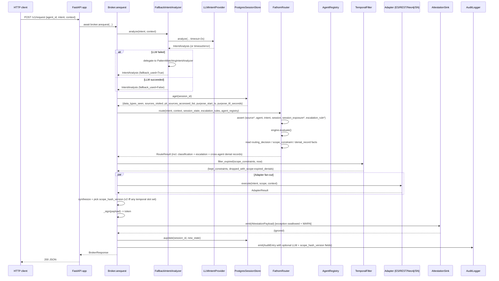

# Design: Nautilus Reasoning Engine (Phase 2 + Phase 3 minus Admin UI)

## 1. Overview

This design **extends** the Phase 1 `core-broker` surface — it does not refactor it. Every Phase 1 Protocol (`Adapter`, `IntentAnalyzer`, `Synthesizer`, `SessionStore`, `AuditSink`) is preserved verbatim; new capabilities land as new subpackages (`nautilus/analysis/llm/`, `nautilus/forensics/`, `nautilus/transport/`), new modules alongside existing ones (`nautilus/core/session_pg.py`, `nautilus/core/attestation_sink.py`, `nautilus/cli.py`), new Protocol members, and *additive, optional* slots on existing Pydantic models. Phase 1 audit lines parse unchanged (NFR-5); Phase 1 attestation tokens verify unchanged (NFR-6). The existing pipeline shape from `core-broker/design.md` §2 is reused; new capabilities slot into it at well-defined extension points.

---

## 2. Architecture

### 2.1 C4-style component diagram — Phase 1 boundary vs reasoning-engine additions

```mermaid
graph TB
    Agent[Agent / SDK caller]
    MCPClient[MCP Client]
    HTTPClient[HTTP Client]

    subgraph P1["Phase 1 (core-broker) — UNCHANGED surfaces"]
        B[Broker.request / arequest]
        IA_P[PatternMatchingIntentAnalyzer]
        SR[SourceRegistry]
        FR[FathomRouter]
        SS_MEM[InMemorySessionStore]
        SYN[BasicSynthesizer]
        AL[AuditLogger]
        AS[AttestationService Ed25519]
        PG[PostgresAdapter]
        PV[PgVectorAdapter]
    end

    subgraph P2["reasoning-engine (NEW)"]
        direction TB
        subgraph P2T["Transport"]
            REST[FastAPI app<br/>transport/fastapi_app.py]
            MCP[FastMCP server<br/>transport/mcp_server.py]
            CLI[nautilus CLI<br/>cli.py]
        end
        subgraph P2R["Reasoning"]
            AR[AgentRegistry<br/>config/agent_registry.py]
            DH[Broker.declare_handoff]
            SS_PG[PostgresSessionStore<br/>core/session_pg.py]
            ESC[EscalationPack loader<br/>rules/escalation/*]
            TMP[TemporalFilter<br/>core/temporal.py]
            HASH2[scope_hash_v2<br/>core/attestation_payload.py]
        end
        subgraph P2A["LLM analysis (optional)"]
            LLM_PROTO[LLMIntentProvider Protocol]
            LLM_A[AnthropicProvider]
            LLM_O[OpenAIProvider]
            LLM_L[LocalInferenceProvider]
            FBA[FallbackIntentAnalyzer]
        end
        subgraph P2AD["New adapters"]
            ES[ElasticsearchAdapter]
            RA[RestAdapter]
            N4[Neo4jAdapter]
            SN[ServiceNowAdapter]
        end
        subgraph P2AT["Attestation dispatch"]
            SINK_P[AttestationSink Protocol]
            SINK_N[NullAttestationSink]
            SINK_F[FileAttestationSink]
            SINK_H[HttpAttestationSink]
        end
        subgraph P2F["Forensics (offline)"]
            FW[handoff_worker<br/>forensics/handoff_worker.py]
            FRP[forensic rule pack]
        end
    end

    Agent --> B
    HTTPClient --> REST --> B
    MCPClient --> MCP --> B
    CLI -.boots.-> REST
    CLI -.boots.-> MCP

    B --> IA_P
    B --> FBA
    FBA --> LLM_PROTO
    FBA --> IA_P
    LLM_PROTO --> LLM_A
    LLM_PROTO --> LLM_O
    LLM_PROTO --> LLM_L

    B --> SR
    B --> FR
    FR --> ESC

    B --> SS_MEM
    B --> SS_PG

    B --> TMP
    TMP --> HASH2

    B --> DH
    DH --> AR
    DH --> FR

    B --> PG
    B --> PV
    B --> ES
    B --> RA
    B --> N4
    B --> SN

    B --> AS
    AS --> SINK_P
    SINK_P --> SINK_N
    SINK_P --> SINK_F
    SINK_P --> SINK_H

    B --> AL
    AL -. appends .-> Audit[(audit.jsonl)]
    Audit --> FW --> FRP
```



Everything in the `P2` block is **NEW**. Everything in `P1` is shipped and untouched except for the three additive extensions called out explicitly in §3: (a) `Broker.__init__` gains constructor args for the new collaborators, (b) `ScopeConstraint` gains two optional slots, (c) `AuditEntry` gains six optional fields. No Phase 1 call site changes.

### 2.2 Sequence — representative reasoning-engine request



### 2.3 Sequence — forensic handoff correlation worker (offline, audit-log driven)

```mermaid
sequenceDiagram
    participant OP as Operator cron / systemd
    participant W as forensics.handoff_worker
    participant OFF as processed-offsets file
    participant AUD as audit.jsonl (append-only)
    participant ENG as Fathom engine + forensic rule pack
    participant OUT as forensic sink (JSONL or HTTP)

    OP->>W: python -m nautilus.forensics.handoff_worker --audit /audit/audit.jsonl --offsets /audit/.forensic-offsets --out /audit/inferred.jsonl
    W->>OFF: read last_offset, seen_line_hashes
    W->>AUD: seek(last_offset); stream lines
    loop per audit line
      W->>W: parse AuditEntry (skip already-seen SHA256)
      W->>ENG: assert_fact(audit_event template)
    end
    W->>ENG: evaluate()
    ENG-->>W: InferredHandoff candidate facts
    W->>W: drop candidates whose (session_id, source_agent, receiving_agent) already have a declared handoff_declared AuditEntry within window
    W->>OUT: append InferredHandoff JSONL lines
    W->>OFF: atomic rename write (new_offset, updated seen-hashes bloom)
    W-->>OP: exit 0
```

---

## 3. Component Responsibilities

Each subsection states **purpose / public interface / dependencies / failure modes / test strategy** and maps the component to the US+FR ids it implements. ~16 components; every US is covered.

### 3.1 `classification.yaml` + `cui-sub.yaml` hierarchy bundle + `source`/`agent` template extensions — **US-1 / FR-1, FR-2**

**Purpose.** Register rank-based classification + sub-category ladders in Fathom; extend Nautilus templates with `compartments` and `sub_category` slots; ship the `default-classification-deny` rule.

**Location.** `nautilus/rules/hierarchies/classification.yaml`, `nautilus/rules/hierarchies/cui-sub.yaml`, extended `nautilus/rules/templates/nautilus.yaml`, new `nautilus/rules/rules/classification.yaml`.

**Interface (rule author-facing).**
```clips
; Rule LHS — primary classification dominance
(fathom-dominates ?clearance ?subj_cmp ?src_cls ?src_cmp "classification")
; Rule LHS — CUI sub-category dominance (second call)
(fathom-dominates ?subj_sub ?subj_cmp ?src_sub ?src_cmp "cui-sub")
```

**Dependencies.** Fathom `>=0.3.0` (`HierarchyDefinition`, `_hierarchy_registry`, `fathom-dominates` external). Phase 1 `FathomRouter` template-assertion loop.

**Failure modes.**
- Missing hierarchy YAML → `fathom.Engine` raises at `Broker.from_config`; `ConfigError` propagates.
- Malformed YAML → pydantic validation error in Fathom's `HierarchyDefinition` at load.
- User drops a custom hierarchy into `user_rules_dirs` → loaded without code change (AC-1.5).

**Test strategy.** (a) Unit: `default-classification-deny` fires when `clearance=cui` and `source.classification=secret` (AC-1.1, AC-1.3). (b) Unit: CUI + CUI-SP-CTI round-trip via two-hierarchy workaround (AC-1.2). (c) Integration: custom hierarchy in `user_rules_dirs/` fires from user rule (AC-1.5).

### 3.2 `SessionStore` Protocol extension + `PostgresSessionStore` — **US-2 / FR-3, FR-4, FR-5**

**Purpose.** Persist cumulative exposure state across requests; survive broker restart; operator-choice failure policy.

**Location.** `nautilus/core/session.py` (extend), `nautilus/core/session_pg.py` (new).

**Interface.**
```python
class SessionStore(Protocol):
    # Phase 1 sync surface — PRESERVED for backwards compat:
    def get(self, session_id: str) -> dict[str, Any]: ...
    def update(self, session_id: str, entry: dict[str, Any]) -> None: ...
    # Phase 2 async surface — NEW; broker prefers async when present:
    async def aget(self, session_id: str) -> dict[str, Any]: ...
    async def aupdate(self, session_id: str, entry: dict[str, Any]) -> None: ...
    async def aclose(self) -> None: ...

class PostgresSessionStore:
    def __init__(self, dsn: str, *, on_failure: Literal["fail_closed","fallback_memory"] = "fail_closed"): ...
    async def setup(self) -> None: ...  # idempotent CREATE TABLE; called from Broker.setup()
```

**Postgres DDL (UQ-1 — locked; see D-2).**
```sql
CREATE TABLE IF NOT EXISTS nautilus_session_state (
    session_id TEXT PRIMARY KEY,
    state JSONB NOT NULL,
    updated_at TIMESTAMPTZ NOT NULL DEFAULT now()
);
```
`Broker.setup()` runs this on first Postgres use (idempotent). The SQL is a stable documented contract so operators under strict RBAC can pre-provision the table themselves and revoke `CREATE TABLE` from the broker's role.

**Dependencies.** `asyncpg >= 0.30` (already present). Reuses Phase 1 pool conventions from `nautilus/adapters/postgres.py`.

**Failure modes.**
- DSN unreachable + `on_failure=fail_closed`: `arequest` raises `SessionStoreUnavailableError`; broker writes an error audit entry with `error_type=SessionStoreUnavailableError` and the request is denied (NFR-7, AC-2.5).
- DSN unreachable + `on_failure=fallback_memory`: broker degrades to an in-process `InMemorySessionStore` bound by a `degraded_since` timestamp; structured WARN log; subsequent `aget` / `aupdate` succeed against memory; each request in degraded mode carries `session_store_mode: "degraded_memory"` in audit.
- Table doesn't exist and `setup()` was never run: `asyncpg` raises `UndefinedTableError` → broker catches in hot path, applies the same `on_failure` policy.
- `Broker.aclose()` calls `session_store.aclose()` before adapter pools (ordering contract).

**Test strategy.** (a) Integration: testcontainer Postgres, `setup()` idempotent on repeated run (AC-2.2). (b) Integration: broker restart with Postgres backend replays state for known session (AC-2.4). (c) Unit: both `on_failure` branches with a mock asyncpg raising `CannotConnectNowError` (AC-2.5). (d) Snapshot test: session facts re-asserted match stored state shape (AC-2.3).

### 3.3 Rich `session` template + `session_exposure` derivation — **US-2, US-3 / FR-5**

**Purpose.** Broker re-expands stored JSONB multislots into Fathom facts per request so rules can pattern-match individual values (`data_types_seen`, `sources_visited`, `pii_sources_accessed_list`) and purpose-TTL slots (`purpose_start_ts`, `purpose_ttl_seconds`).

**Location.** `nautilus/rules/templates/nautilus.yaml` (template extension); `nautilus/core/fathom_router.py::_assert_session` (extension).

**Interface.** Template YAML gains four multislot and two scalar slots; `_assert_session` iterates the multislots and asserts one `session_exposure` fact per element.

**Failure modes.** Pre-existing Phase 1 session state with only `id` / `pii_sources_accessed` still parses — new multislots default to empty; no migration required.

**Test strategy.** Snapshot test: asserted facts summary for a session with N PII sources produces N `session_exposure` facts (AC-2.3).

### 3.4 `contains-all` CLIPS external + `escalation_rule` template + escalation pack loader — **US-3 / FR-6, FR-7**

**Purpose.** Declarative escalation rules that fire when the session has accumulated a combination of data types.

**Location.** `nautilus/rules/functions/contains_all.py` (new external), `nautilus/rules/templates/nautilus.yaml` (new template), `nautilus/rules/escalation/default.yaml` (default pack), `nautilus/config/escalation.py` (loader; new).

**Interface.**
```python
def contains_all(super_set: list[str], sub_set: list[str]) -> bool: ...

class EscalationRule(BaseModel):
    id: str
    trigger_combination: str  # space-sep
    resulting_level: str
    action: Literal["deny","escalate","notify"]
```

**Dependencies.** Fathom external registration pattern (`overlaps` precedent at `nautilus/rules/functions/overlaps.py`).

**Failure modes.** Malformed YAML in operator escalation dir → `ConfigError` at load; invalid `action` value → pydantic rejects.

**Test strategy.** (a) Unit: `contains-all` empty + full + partial overlap + disjoint (AC-3.4). (b) Integration: default pack fires on PII-aggregation combination (AC-3.3). (c) Unit: `action=notify` path produces notify record without denial (AC-3.5).

### 3.5 `AgentRegistry` + `agents:` config — **US-4 / FR-9**

**Purpose.** Authoritative map of `agent_id → (clearance, compartments, default_purpose)` so `declare_handoff` can look up receiving clearance.

**Location.** `nautilus/config/agent_registry.py` (new); `NautilusConfig.agents: dict[str, AgentRecord]` added to `nautilus/config/models.py`.

**Interface.**
```python
class AgentRecord(BaseModel):
    id: str
    clearance: str
    compartments: list[str] = []
    default_purpose: str | None = None

class AgentRegistry:
    def get(self, agent_id: str) -> AgentRecord: ...  # raises UnknownAgentError
    def __iter__(self) -> Iterator[AgentRecord]: ...
```

**Dependencies.** `NautilusConfig` pydantic model. Trusted input (operator-authored YAML).

**Failure modes.** Unknown agent id → `UnknownAgentError` raised from `declare_handoff`; one audit entry written (`event_type: handoff_declared`, `action: deny`, `denial_record.rule_name: unknown-agent`).

**Test strategy.** Unit — missing id raises; iterating preserves YAML order; Phase 1 YAML fixtures without `agents:` still load.

### 3.6 `data_handoff` template + `Broker.declare_handoff` API + `information-flow-violation` rule — **US-4 / FR-8, FR-10**

**Purpose.** Cooperative cross-agent flow detection: orchestrators explicitly declare handoffs; broker runs a reasoning-only Fathom evaluation and returns `HandoffDecision`. Zero adapter calls.

**Location.** `nautilus/core/broker.py::declare_handoff` (new public method); `nautilus/rules/templates/nautilus.yaml` (new `data_handoff` template); `nautilus/rules/rules/handoff.yaml` (new default rule).

**Interface.**
```python
class HandoffDecision(BaseModel):
    handoff_id: str  # UUIDv4
    action: Literal["allow","deny","escalate"]
    denial_records: list[DenialRecord]
    rule_trace: list[str]

async def declare_handoff(
    self,
    *,
    source_agent_id: str,
    receiving_agent_id: str,
    session_id: str,
    data_classifications: list[str],
    rule_trace_refs: list[str] = [],
    data_compartments: list[str] = [],
) -> HandoffDecision: ...
```

**Flow.** (1) Resolve both agents via `AgentRegistry`. (2) Assert one `data_handoff` fact per classification. (3) Call `engine.evaluate()` with the handoff rule pack. (4) Collect `denial_record` facts. (5) Audit one entry with `event_type: "handoff_declared"`. (6) Return `HandoffDecision`.

**Failure modes.** Unknown agent, no classifications supplied (empty list → `ValidationError`), session store unreachable in fail-closed mode (inherits policy).

**Test strategy.** (a) Unit: allow / deny / escalate branches (AC-4.1, AC-4.3). (b) Audit test: exactly one audit entry per call (AC-4.4). (c) Concurrency test: `asyncio.gather` of 50 calls with shared `session_id` produces 50 distinct `handoff_id`s (AC-4.5). (d) Zero-adapter assertion: mock adapters — none are called (AC-4.1).

### 3.7 Forensic handoff worker + forensic rule pack — **US-5 / FR-11, FR-12, FR-33**

**Purpose.** Offline, audit-log-driven inference of undeclared handoffs. Air-gap compatible — reads files, writes files, no network.

**Location.** `nautilus/forensics/__init__.py`, `nautilus/forensics/handoff_worker.py`, `nautilus/forensics/offsets.py`, `nautilus/forensics/sinks.py` (JSONL, HTTP), `nautilus/rules/forensics/handoff.yaml` (new rule pack).

**Interface.**
```python
class InferredHandoff(BaseModel):
    session_id: str
    source_agent: str
    receiving_agent: str
    confidence: float
    signals: list[str]
    inferred_at: datetime

class ProcessedOffsets(BaseModel):
    last_byte_offset: int
    seen_line_sha256: set[str]  # bounded-size rolling set (LRU, capacity=10**6)

def run_worker(audit_path: Path, offsets_path: Path, out_sink: ForensicSink, *, window_s: int = 3600) -> WorkerReport: ...
```

**Rule pack.** Three heuristics in `handoff.yaml`:
- **`h-shared-session`**: two distinct `agent_id`s touch the same `session_id` within the window.
- **`h-source-overlap`**: two agents share ≥1 `sources_queried` entry within the window.
- **`h-classification-delta`**: later agent queries a *lower* max classification than the earlier one did (possible declassification flow).
Each produces an `InferredHandoff` fact with a `confidence` slot summed from salience-weighted signals.

**Deduplication.**
1. **Line-level**: each parsed audit line's SHA256 is recorded in `ProcessedOffsets.seen_line_sha256`; re-runs skip already-seen lines (NFR-13, AC-5.4).
2. **Handoff-level**: before emission, the worker scans the same audit segment for `event_type: "handoff_declared"` records matching `(session_id, source_agent, receiving_agent)` inside the window and drops matching inferred candidates (FR-33, AC-5.3).
3. **Offsets-file write is atomic**: worker writes `offsets.tmp` then `os.replace(tmp, target)`.

**Failure modes.** Offsets file corruption (truncated JSON / non-monotonic `last_byte_offset`): worker raises `OffsetsCorruptError`, exits non-zero, does NOT advance offsets. Operator must archive and re-run from 0.

**Test strategy.** (a) Integration: synthetic 10k-line audit log → worker emits the expected `InferredHandoff`s (FR-12). (b) Idempotency: re-run yields 0 new records (NFR-13, AC-5.4). (c) Declared-precedence: synthetic log containing both declared and undeclared — only undeclared inferred (AC-5.3). (d) Air-gap: worker under network-blocked container produces output (AC-5.5).

### 3.8 `LLMIntentProvider` Protocol + 3 providers + `FallbackIntentAnalyzer` — **US-6 / FR-13, FR-14, FR-15**

**Purpose.** Optional pluggable LLM intent analysis with a deterministic pattern fallback; air-gap-forced to pattern under `--air-gapped`.

**Location.** `nautilus/analysis/llm/base.py`, `nautilus/analysis/llm/anthropic_provider.py`, `nautilus/analysis/llm/openai_provider.py`, `nautilus/analysis/llm/local_provider.py`, `nautilus/analysis/llm/prompts/intent_v1.txt`, `nautilus/analysis/fallback.py`.

**Protocol shape.**
```python
class LLMProviderError(Exception): ...

class LLMIntentProvider(Protocol):
    model: str              # pinned; surfaces as audit.llm_model
    provider_name: str      # surfaces as audit.llm_provider
    prompt_version: str     # surfaces as audit.prompt_version
    async def analyze(self, intent: str, context: dict[str, Any]) -> IntentAnalysis: ...
    def health_check(self) -> None: ...  # raises LLMProviderError if unreachable

class FallbackIntentAnalyzer:
    def __init__(
        self,
        primary: LLMIntentProvider,
        fallback: IntentAnalyzer,
        *,
        timeout_s: float = 2.0,
        mode: Literal["llm-first","llm-only"] = "llm-first",
    ): ...
    async def analyze(self, intent: str, context: dict) -> tuple[IntentAnalysis, LLMProvenance]:
        # raises if mode=='llm-only' and primary fails
```

`LLMProvenance` (internal dataclass): `provider`, `model`, `version`, `prompt_version`, `raw_response_hash`, `fallback_used`. Broker copies it into `AuditEntry` fields.

**Provider implementations.**
- `AnthropicProvider`: uses `anthropic` SDK with tool-use binding to `IntentAnalysis.model_json_schema()`; `temperature=0`, `max_tokens=512`.
- `OpenAIProvider`: uses `openai` SDK `responses.parse` with Pydantic schema; `temperature=0`.
- `LocalInferenceProvider`: uses `openai` SDK pointed at a custom `base_url` (vLLM, llama.cpp OpenAI-compat endpoint). Air-gap-compatible when endpoint is co-located.

**Prompt template.** Single locked file `intent_v1.txt`; `prompt_version` is the filename suffix. Prompt is a Jinja-lite `$var` substitution (stdlib `string.Template`) — no Jinja dep.

**Dependencies.** `anthropic >= 0.40` (extra `llm-anthropic`), `openai` (extra `llm-openai`). Neither is a required dep — `pyproject.toml` uses PEP 735 extras.

**Failure modes (exhaustive — AC-6.2).**
- `asyncio.TimeoutError` (exceeds `timeout_s`) → fallback.
- `LLMProviderError` (connect, 5xx, authentication) → fallback.
- `pydantic.ValidationError` (model emitted non-conforming JSON) → fallback.
- `mode="llm-only"` + any of above → raise; broker fails-closed with structured error audit (AC-6.3).

**Test strategy.** (a) Fixture-based tests per provider using `pytest-recording` cassettes (AC-6.6). (b) Each failure path triggers fallback (AC-6.2). (c) `--air-gapped` override forces pattern with WARN (AC-6.4). (d) Determinism harness: 100 fixture prompts run under `llm-first` with a recorded cassette, ≥95 yield identical routing-relevant verdict + sensitivity (NFR-12).

### 3.9 Temporal scoping (`expires_at`/`valid_from` slots, `TemporalFilter`, `purpose-expired-deny` rule) — **US-7 / FR-17, FR-18**

**Purpose.** Scope constraints carry optional ISO-8601 time-window slots; a broker-side filter drops expired/not-yet-valid constraints AND emits `denial_record` entries. Separately, the session's purpose TTL denies stale-purpose requests via `fathom-changed-within`.

**Location.**
- `nautilus/rules/templates/nautilus.yaml` (extend `scope_constraint` with `expires_at`, `valid_from`; extend `session` with `purpose_start_ts`, `purpose_ttl_seconds`).
- `nautilus/core/temporal.py` (new `TemporalFilter`).
- `nautilus/core/models.py` (add `expires_at: str | None`, `valid_from: str | None` to `ScopeConstraint`).
- `nautilus/rules/rules/temporal.yaml` (new `purpose-expired-deny` rule using `fathom-changed-within`).

**Interface.**
```python
class TemporalFilter:
    @staticmethod
    def apply(
        constraints: dict[str, list[ScopeConstraint]],
        now: datetime,
    ) -> tuple[dict[str, list[ScopeConstraint]], list[DenialRecord]]: ...
```
Returns kept constraints + one `denial_record` per dropped constraint with `rule_name="scope-expired"`.

**Failure modes.** Malformed ISO-8601 → constraint is dropped with `rule_name="scope-expired"` and an audit warning (fail-closed: if we can't parse, we assume expired).

**Test strategy.** Unit: each temporal branch (past expiry / future valid / both empty / malformed) (AC-7.1, AC-7.2); integration: purpose TTL expiry (AC-7.3, FR-18).

### 3.10 `scope_hash_v2` + `AuditEntry.scope_hash_version` — **US-7, US-14 / FR-16, FR-19**

**Purpose.** Version the attestation scope hash so v1 tokens remain verifiable unchanged while new temporal slots become hashable.

**Location.** `nautilus/core/attestation_payload.py` (extend); `nautilus/core/models.py` (extend `AuditEntry`).

**Canonicalization rule (see D-8 for audit-field placement; FR-19 for conditional emission).**
- **v1 (unchanged, frozen)**: canonical JSON over the tuple list `[{source_id, field, operator, value}, ...]` sorted by `(source_id, field, operator)` then SHA256.
- **v2 (new)**: canonical JSON over `[{source_id, field, operator, value, expires_at, valid_from}, ...]`, same sort, same SHA256. `expires_at` and `valid_from` serialize as empty strings when unset — **but v2 is emitted ONLY when at least one constraint on the request has either slot non-empty** (FR-19). Otherwise v1 is used. This is a request-conditional choice, not a version bump.

**Emission.**
```python
def build_payload(...) -> tuple[dict, Literal["v1","v2"]]:
    version = "v2" if any(c.expires_at or c.valid_from for c in all_constraints) else "v1"
    # compute scope_hash per version
    return payload, version
```
Broker stores the returned version in `AuditEntry.scope_hash_version`.

**`AuditEntry` additions (all Optional — FR-16, NFR-5).**
- `llm_provider: str | None`
- `llm_model: str | None`
- `llm_version: str | None`
- `raw_response_hash: str | None`
- `prompt_version: str | None`
- `fallback_used: bool | None`
- `scope_hash_version: Literal["v1","v2"] | None`
- `session_id_source: Literal["context","transport","stdio_request_id"] | None`  # UQ-4 (see D-10)
- `session_store_mode: Literal["primary","degraded_memory"] | None`  # NFR-7
- `event_type: Literal["request","handoff_declared"] | None` (default `"request"` for Phase 1 parseability)
- `handoff_id: str | None`
- `handoff_decision: HandoffDecision | None`

**Backwards-compat test.** Recorded Phase 1 `audit.jsonl` fixture must round-trip via `AuditEntry.model_validate_json` (NFR-5). Recorded Phase 1 attestation token fixture must verify under the Phase 2 verifier (NFR-6, AC-7.5).

### 3.11 Four new adapters — **US-8..US-11 / FR-20..FR-24**

Each adapter implements the Phase 1 `Adapter` Protocol verbatim. Consolidated summary (§6.3 below covers error handling):

| Adapter | Module | Library | Target field | Drift-guard |
|---|---|---|---|---|
| Elasticsearch | `nautilus/adapters/elasticsearch.py` | `elasticsearch.AsyncElasticsearch` + `elasticsearch.dsl.AsyncSearch` | `SourceConfig.index` (regex `^[a-z0-9][a-z0-9._-]*$`) | every `_OPERATOR_ALLOWLIST` entry → DSL round-trip |
| REST | `nautilus/adapters/rest.py` | `httpx.AsyncClient(follow_redirects=False)` | `SourceConfig.endpoints: list[EndpointSpec]` + `SourceConfig.auth` | every operator → declared template OR explicitly rejected |
| Neo4j | `nautilus/adapters/neo4j.py` | `neo4j.AsyncGraphDatabase.driver` + `execute_query(..., routing_=READ)` | `SourceConfig.label` (regex `^[A-Z][A-Za-z0-9_]*$`) backticked | every operator → Cypher round-trip |
| ServiceNow | `nautilus/adapters/servicenow.py` | `httpx.AsyncClient` against `/api/now/table/<t>` | `SourceConfig.table` (regex `^[a-z][a-z0-9_]*$`) | every operator → encoded-query round-trip + `^`/`\n`/`\r` injection rejection |

**Shared** `EndpointSpec`, `AuthConfig` (discriminated union: `bearer|basic|mtls|none`) live in `nautilus/config/models.py`. All four adapters share the `_closed` idempotency pattern from Phase 1 `PostgresAdapter.close`.

**Dependencies (NFR-11).** `elasticsearch>=8`, `neo4j>=5`, `httpx>=0.27`. No new dep beyond whitelisted.

**Failure modes.** ScopeEnforcementError → `sources_denied`. Backend unreachable → `sources_errored` + `error_type: <AdapterName>Error`. Redirect to different host (REST only, NFR-17) → `SSRFBlockedError`. ServiceNow `^`/`\n`/`\r` in value → `ScopeEnforcementError` (NFR-18).

**Test strategy.** Per-adapter drift-guard extending the Phase 1 pattern (NFR-4); per-adapter integration with testcontainers (ES, Neo4j, Postgres for REST fixtures) or `respx` mock (ServiceNow — no testcontainer).

### 3.12 FastAPI REST transport — **US-12 / FR-25, FR-26**

**Purpose.** HTTP surface for non-Python agents.

**Location.** `nautilus/transport/__init__.py`, `nautilus/transport/fastapi_app.py`, `nautilus/transport/auth.py` (shared `APIKeyHeader` + `proxy_trust` middleware).

**Factory.**
```python
def create_app(config_path: str | Path) -> FastAPI: ...
```

**Lifespan.** `asynccontextmanager`; on startup construct `broker = Broker.from_config(path)` once (singleton on `app.state.broker`); `/readyz` returns 503 until startup completes and 200 afterwards; shutdown awaits `broker.aclose()`. Handlers inject via `Depends(get_broker)` which reads `app.state.broker` — no `run_in_executor`, `arequest` called directly (AC-12.5).

**Endpoints.**
- `POST /v1/request` — body `BrokerRequest`, response `BrokerResponse`.
- `POST /v1/query` — **literal alias** of `/v1/request` (UQ-3 — locked; see D-9). Reserved for future split.
- `GET /v1/sources` — metadata only (no secrets).
- `GET /healthz` — static 200.
- `GET /readyz` — 200 iff lifespan startup complete and `broker.session_store` reachable.

**Auth.** Default `APIKeyHeader(name="X-API-Key", auto_error=True)` + `secrets.compare_digest` against `config.api.keys`. Opt-in `config.api.auth.mode: "proxy_trust"` reads `X-Forwarded-User`.

**Failure modes.** Missing key → HTTP 401. `broker.arequest` raises `PolicyEngineError` → HTTP 500 with request_id; audit entry still written. Lifespan failure → uvicorn exits non-zero (correct behavior for container orchestrator restart).

**Test strategy.** HTTP integration via `httpx.AsyncClient(transport=ASGITransport(app))`; verify 1:1 HTTP:audit ratio (NFR-15); p95 latency harness per AC-12.6 (1000 sequential calls, discard first 100, p95 over remaining 900 < 200 ms).

### 3.13 MCP tool server — **US-13 / FR-27**

**Purpose.** Expose `broker.arequest` as an MCP tool over stdio and streamable-http.

**Location.** `nautilus/transport/mcp_server.py`.

**Factory.**
```python
def create_server(config_path: str | Path) -> FastMCP: ...
```

**Server config.** `FastMCP(name="nautilus", stateless_http=True, json_response=True)`. HTTP transport wraps the Starlette sub-app with the same `APIKeyHeader` middleware from `transport/auth.py` (shared with REST).

**Tool.**
```python
@mcp.tool()
async def nautilus_request(
    agent_id: str, intent: str, context: dict[str, Any] = {}, ctx: Context | None = None
) -> BrokerResponse: ...
```
Return type `BrokerResponse` auto-generates MCP structured-output schema via FastMCP's Pydantic introspection (FR-27, AC-13.4).

**Optional tool** (opt-in via config `mcp.expose_declare_handoff: true`):
```python
@mcp.tool()
async def nautilus_declare_handoff(...) -> HandoffDecision: ...
```

**Session-id resolution (UQ-4 — LOCKED; see D-10).**
1. If `context["session_id"]` present → use verbatim. Set `audit.session_id_source = "context"`.
2. Else if http mode → use `ctx.session_id` (FastMCP streamable-http session). Set `audit.session_id_source = "transport"`.
3. Else (stdio) → use `ctx.request_id`. Set `audit.session_id_source = "stdio_request_id"`.

**Broker singleton.** `create_server` shares one `Broker` instance with the REST factory when `--transport both` is used. CLI wires both factories to the same broker instance before invoking `uvicorn.Server` and `FastMCP.run_async` concurrently (NFR-14).

**Test strategy.** MCP SDK `Client` integration over both transports; end-to-end tool call produces exactly one audit entry; `agent_id` never derived from MCP `client_id` (AC-13.3).

### 3.14 `AttestationSink` Protocol + three sinks — **US-14 / FR-28, FR-29**

**Purpose.** Durable, store-and-forward delivery of signed attestation payloads; parallels Phase 1 `AuditSink`.

**Location.** `nautilus/core/attestation_sink.py`.

**Protocol.**
```python
class AttestationPayload(BaseModel):
    token: str
    nautilus_payload: dict[str, Any]
    emitted_at: datetime

class AttestationSink(Protocol):
    async def emit(self, payload: AttestationPayload) -> None: ...
    async def close(self) -> None: ...
```

**Implementations.**
- `NullAttestationSink` — no-op; default. Token still signed and returned on `BrokerResponse.attestation_token` (AC-14.4).
- `FileAttestationSink(path)` — append-only JSONL; `flush()` + `os.fsync(fd)` per entry (AC-14.2).
- `HttpAttestationSink(url, retry_policy, dead_letter_path)` — `httpx.AsyncClient`; configurable retries; on persistent failure writes to wrapped `FileAttestationSink(dead_letter_path)` (AC-14.3).

**Broker integration.** After `_sign()` returns, `broker._emit_attestation(sink, payload)` awaits `sink.emit(...)` inside `try/except Exception as exc: log.warning(...)` — never fails the hot path (NFR-16, AC-14.5). `Broker.aclose()` awaits `sink.close()` AFTER `session_store.aclose()` and BEFORE adapter-pool release (AC-14.6).

**Test strategy.** Per-sink unit; fault-injection: 1000-request run with `emit` forced to raise on every 2nd call → 0 requests failed (NFR-16).

### 3.15 `nautilus` CLI — **US-15 / FR-30**

**Purpose.** Bootable entrypoint for Docker, systemd, local dev.

**Location.** `nautilus/cli.py`, `nautilus/__main__.py` (one-liner delegating to `cli.main()`).

**Surface (stdlib `argparse` — no Click/Typer — FR-30).**
```
nautilus --help
nautilus version
nautilus health [--url http://localhost:8000/readyz]
nautilus serve
    --config PATH
    --transport rest|mcp|both   (default: rest)
    --mcp-mode stdio|http       (default: http; ignored unless transport includes mcp)
    --bind HOST:PORT            (default: 0.0.0.0:8000 for rest, :8766 for mcp http)
    --air-gapped                (force analysis.mode=pattern, refuse any LLM provider config)
```

`health` uses stdlib `urllib.request` only (no `requests`, no shell) so it runs under distroless.

**`--air-gapped` enforcement.** CLI post-processes the loaded `NautilusConfig`: if `analysis.mode != "pattern"` → override to `"pattern"`; if any LLM provider config present → log WARN naming the overridden field (AC-6.4, AC-15.2, NFR-1).

**Failure modes.** Missing/invalid config path → clear error + exit before any network bind (AC-15.5). Invalid transport combo → argparse-level error.

**Test strategy.** Unit tests per subcommand; end-to-end smoke test runs `serve` in a subprocess and curls `/readyz`.

### 3.16 Multi-stage Dockerfile — **US-16 / FR-31, FR-32**

**Purpose.** Distroless runtime image; optional debug image from same Dockerfile.

**Location.** `Dockerfile` (repo root), `.dockerignore`.

**Stages.**
1. **`builder`** (`ghcr.io/astral-sh/uv:python3.14-bookworm-slim`): `uv sync --frozen --no-dev` into `/app/.venv`; `COPY nautilus /app/nautilus`.
2. **`runtime`** (`gcr.io/distroless/cc-debian13`): `COPY --from=builder /app /app`; `ENV PYTHONPATH=/app PATH=/app/.venv/bin:$PATH`; `ENTRYPOINT ["/app/.venv/bin/python","-m","nautilus"]`; `CMD ["serve","--config","/config/nautilus.yaml"]`; `HEALTHCHECK CMD ["/app/.venv/bin/python","-m","nautilus","health"]`.
3. **`debug`** (from `python:3.14-slim`; `FROM python:3.14-slim AS debug`): same copy; adds `bash`; NOT built by default CI (UQ-5 — LOCKED; see D-17). Operators build locally with `docker build --target debug -t nautilus:x.y.z-debug .`.

**Mount points documented in `README`:** `/config` (ro), `/rules` (ro), `/audit` (rw), `/keys` (ro).

**Test strategy.** CI smoke: build runtime, `docker image inspect` asserts size ≤ 200 MB (NFR-10); boot container with `nautilus.yaml` + Postgres testcontainer, `POST /v1/request` round-trips; `docker run nautilus --entrypoint sh` fails (no shell — AC-16.5); `--target debug` build succeeds but is NOT published by the workflow (UQ-5).

---

## 4. Technical Decisions

| # | Decision | Alternatives | Choice | Rationale |
|---|---|---|---|---|
| D-1 | Session-store backend (cumulative exposure) | a) in-memory only; b) Redis; c) Postgres | **Postgres** | Already ships `asyncpg`; same air-gap / DSN / pool conventions as Phase 1; Redis adds a second stateful process with no corresponding benefit (research §A.2). |
| D-2 | Session-store DDL ownership (UQ-1) | a) require operator pre-provision; b) `Broker.setup()` idempotent CREATE; c) Alembic migration pkg | **`Broker.setup()` idempotent CREATE TABLE IF NOT EXISTS, SQL documented for RBAC pre-provision** | Mirrors Fathom `PostgresFactStore._ensure_schema` precedent (proven pattern). Documented SQL gives RBAC-locked operators a pre-provision escape. Alembic overkill for a 1-table schema (UQ-1 locked). |
| D-3 | Session-store failure policy | a) always fail-closed; b) always degrade; c) operator-chosen | **Operator-chosen (`fail_closed` or `fallback_memory`)** | Air-gap operators rightly prefer fail-closed; connected operators may prefer degraded. Cannot pick a universal default (NFR-7). |
| D-4 | Cross-agent handoff detection | a) cooperative only (`declare_handoff`); b) forensic only (audit correlation); c) both | **Both (interview decision)** | Cooperative is precise but requires well-behaved orchestrators; forensic is best-effort but covers malicious/buggy orchestrators. They compose cleanly because forensic dedupes against declared. |
| D-5 | LLM provider shape | a) one concrete Anthropic impl; b) abstract base class with 3 subclasses; c) `LLMIntentProvider` Protocol with 3 structural implementers | **Protocol + 3 providers** | Matches Phase 1 pluggability (IntentAnalyzer, Adapter, AuditSink). Duck-typed; providers don't inherit a brittle base; new providers ship without code changes to the broker. |
| D-6 | LLM fallback mechanism | a) retry-with-backoff on LLM; b) per-call timeout + delegate to pattern analyzer; c) circuit-breaker | **Per-call `asyncio.timeout(...)` + catch `TimeoutError \| LLMProviderError \| ValidationError` → pattern** (FR-14) | Simplest thing that can't be wrong. No hidden retry amplifies verifier load during outages. Circuit-breaker state is hard to reason about in an air-gap audit surface. |
| D-7 | `scope_hash_v2` canonicalization (vs v1) | a) add `expires_at`/`valid_from` directly to v1 hash (break NFR-6); b) v2 over the full 6-tuple, always emit; c) v2 conditional (emit only when temporal slots set) | **Conditional v2 (FR-19)** | NFR-6 forbids breaking Phase 1 token verification; unconditionally emitting v2 would change every hash; conditional preserves Phase 1 hash exactly when no temporal slots present. `AuditEntry.scope_hash_version` discriminates. |
| D-8 | LLM audit-field placement (UQ-2) | a) sidecar `intent_analysis_trace.jsonl` joined by request_id; b) optional fields on `AuditEntry` | **Optional fields on `AuditEntry` (FR-16)** | Phase 1 `AuditEntry.model_validate_json` must still parse old lines (NFR-5) — all new fields are `... | None = None`. Single-line audit is operationally simpler (one file to rotate, one grep to correlate). Sidecar adds a join-at-query-time tax. (UQ-2 locked.) |
| D-9 | `/v1/query` semantics (UQ-3) | a) omit endpoint; b) alias `/v1/request`; c) split semantics now | **Alias `/v1/request`** | Reserves the URL for future query-style split without client churn. Omitting forces a breaking client change later. Splitting now re-opens scope beyond Phase 2 (structured `{data_types, filters}` semantics). (UQ-3 locked.) |
| D-10 | MCP session-id fallback (UQ-4) | a) require `context["session_id"]`, 4xx on absence; b) fall back to transport id; c) mint random UUID | **Transport-derived fallback** (http → session id, stdio → request id), recorded in `audit.session_id_source` | Requiring `session_id` breaks zero-config MCP callers; random UUID conflates unrelated callers and breaks cumulative-exposure tracking. Transport-derived is deterministic for the caller and observable in audit. (UQ-4 locked.) |
| D-11 | REST auth default | a) OAuth2/OIDC; b) API key (`X-API-Key`); c) proxy-trust only | **API key default, proxy-trust opt-in** | OAuth2 requires an IdP — incompatible with strict air-gap. API key is local-only, no network round-trip, `secrets.compare_digest` is constant-time. Proxy-trust is the escape hatch for mesh deployments. (FR-26.) |
| D-12 | MCP server config | a) stateful streamable-http; b) `stateless_http=True, json_response=True`; c) SSE only | **`stateless_http=True, json_response=True`** | Stateless is air-gap- and horizontal-scale-friendly; `json_response=True` simplifies verifier/tracing. SSE (legacy) deprecated in MCP transport roadmap. Stdio for single-process, http for networked. |
| D-13 | REST transport broker integration | a) `run_in_executor` bridge; b) sync `broker.request` in threadpool; c) direct `await broker.arequest(...)` | **Direct `await broker.arequest`** | `arequest` is async-native (Phase 1 contract). `run_in_executor` would serialize through a threadpool and defeat FastAPI concurrency. No bypass of the audit pipeline (AC-12.5). |
| D-14 | FastAPI broker lifecycle | a) per-request construction; b) lru_cache-based singleton; c) lifespan-managed on `app.state.broker` | **Lifespan on `app.state.broker`** | FastAPI-canonical pattern. Startup failure propagates to uvicorn exit (correct under k8s restart). `/readyz` gates until startup complete. |
| D-15 | CLI framework (FR-30) | a) `click`; b) `typer`; c) stdlib `argparse` | **Stdlib `argparse`** | No new dep; trivially air-gap-friendly; distroless-compatible; sufficient for 3 subcommands. `click`/`typer` add transitive deps (colorama, rich) unwelcome in the distroless target. |
| D-16 | Docker runtime base | a) `python:3.14-slim`; b) alpine; c) distroless cc-debian13 | **Distroless cc-debian13** | ~25 MB base; no shell, no apt, no pkg manager (attack surface); 3.14 available; `uv` builder handles Python install in builder stage. Alpine's musl breaks asyncpg/cryptography wheels. |
| D-17 | Docker `-debug` image publication (UQ-5) | a) publish alongside every tag; b) build target only, operator-local; c) separate repo | **Build target, not published by CI** | Default deployment is distroless (smaller attack surface). Operators who need bash/gdb build locally with `--target debug`. Publishing doubles the CI burden and registry storage for a rarely-used image. (UQ-5 locked.) |
| D-18 | `AttestationSink` Protocol shape | a) extend `AuditSink`; b) separate Protocol mirroring `AuditSink`; c) inline `Callable[[Payload], Awaitable[None]]` | **Separate Protocol (parallel to `AuditSink`)** | Attestation payload has distinct lifecycle (store-and-forward to verifier) from audit (immutable local record). Sharing a Protocol would force confusing dual-purpose implementations. (FR-28.) |
| D-19 | ServiceNow client library | a) `pysnow`; b) `aiosnow`; c) `httpx` direct | **`httpx` direct against Table API** | `pysnow` unmaintained/sync; `aiosnow` adds `aiohttp` dep; `httpx` already needed for the REST adapter. Single HTTP client across two adapters. (Research §B.4.) |
| D-20 | Forensic worker transport | a) run in-broker on background loop; b) Redis stream; c) offline CLI process | **Offline CLI process reading audit JSONL** | Air-gap compatible (no network), crash-safe (processed-offsets file), decoupled from the request path (zero latency impact). Re-runs are idempotent via line-hash dedup. (FR-11, NFR-13, AC-5.5.) |

---

## 5. File Structure

```
nautilus/
├── __init__.py                                           [UNCHANGED]
├── __main__.py                                           [NEW] one-liner: from nautilus.cli import main; main()
├── cli.py                                                [NEW] argparse; serve|health|version
├── adapters/
│   ├── __init__.py                                       [MODIFIED] register 4 new adapters in ADAPTER_REGISTRY
│   ├── base.py                                           [UNCHANGED — Phase 1 Protocol preserved]
│   ├── postgres.py                                       [UNCHANGED — Phase 1 surface preserved]
│   ├── pgvector.py                                       [UNCHANGED — Phase 1 surface preserved]
│   ├── embedder.py                                       [UNCHANGED]
│   ├── elasticsearch.py                                  [NEW] ElasticsearchAdapter
│   ├── rest.py                                           [NEW] RestAdapter + SSRF defense
│   ├── neo4j.py                                          [NEW] Neo4jAdapter
│   └── servicenow.py                                     [NEW] ServiceNowAdapter + _sanitize_sn_value
├── analysis/
│   ├── base.py                                           [UNCHANGED — IntentAnalyzer Protocol preserved]
│   ├── pattern_matching.py                               [UNCHANGED — default analyzer preserved]
│   ├── fallback.py                                       [NEW] FallbackIntentAnalyzer
│   └── llm/
│       ├── __init__.py                                   [NEW]
│       ├── base.py                                       [NEW] LLMIntentProvider Protocol, LLMProviderError, LLMProvenance
│       ├── anthropic_provider.py                         [NEW]
│       ├── openai_provider.py                            [NEW]
│       ├── local_provider.py                             [NEW]
│       └── prompts/
│           └── intent_v1.txt                             [NEW] locked template
├── audit/
│   └── logger.py                                         [MODIFIED] emit optional new fields (audit-canonicalization unaffected because all new fields are additive)
├── config/
│   ├── loader.py                                         [MODIFIED] env-interp for new ${...} fields (agents.*, api.*, attestation.sink.*)
│   ├── models.py                                         [MODIFIED] add AgentRecord, NautilusConfig.agents, NautilusConfig.api, NautilusConfig.analysis (modes), NautilusConfig.attestation.sink, NautilusConfig.session_store, SourceConfig.{index,label,endpoints,auth}, EndpointSpec, AuthConfig (discriminated union)
│   ├── registry.py                                       [MODIFIED] accept 4 new source types; unknown type still raises
│   ├── agent_registry.py                                 [NEW] AgentRegistry
│   └── escalation.py                                     [NEW] YAML loader producing EscalationRule list
├── core/
│   ├── broker.py                                         [MODIFIED] add .setup(), .declare_handoff(...), LLM analyzer wiring, TemporalFilter application, scope_hash_version emission, AttestationSink.emit, session_store degraded-mode handling. Phase 1 public method signatures preserved.
│   ├── fathom_router.py                                  [MODIFIED] assert new session_exposure/escalation_rule/data_handoff facts; load new template slots
│   ├── models.py                                         [MODIFIED] ScopeConstraint.expires_at/valid_from; AuditEntry new optional fields; BrokerRequest; HandoffDecision
│   ├── attestation_payload.py                            [MODIFIED] conditional v1/v2 emission; returns (payload, version)
│   ├── attestation_sink.py                               [NEW] AttestationSink Protocol + Null/File/Http impls + AttestationPayload
│   ├── session.py                                        [MODIFIED] extend SessionStore Protocol with async aget/aupdate/aclose (kept backwards-compat — sync methods preserved; broker prefers async if implementer provides them)
│   ├── session_pg.py                                     [NEW] PostgresSessionStore + setup() DDL
│   ├── temporal.py                                       [NEW] TemporalFilter.apply
│   └── clips_encoding.py                                 [UNCHANGED]
├── forensics/
│   ├── __init__.py                                       [NEW]
│   ├── handoff_worker.py                                 [NEW] run_worker() + __main__ for CLI invocation
│   ├── offsets.py                                        [NEW] ProcessedOffsets (atomic write)
│   └── sinks.py                                          [NEW] ForensicSink Protocol + JSONLForensicSink + HttpForensicSink
├── rules/
│   ├── templates/
│   │   └── nautilus.yaml                                 [MODIFIED] extend source, agent, session, scope_constraint templates; add data_handoff, escalation_rule, session_exposure, audit_event templates
│   ├── rules/
│   │   ├── classification.yaml                           [NEW] default-classification-deny (salience 150)
│   │   ├── handoff.yaml                                  [NEW] information-flow-violation
│   │   ├── temporal.yaml                                 [NEW] purpose-expired-deny
│   │   ├── denial.yaml                                   [UNCHANGED]
│   │   └── routing.yaml                                  [UNCHANGED]
│   ├── escalation/
│   │   └── default.yaml                                  [NEW] PII-aggregation combination pack
│   ├── forensics/
│   │   └── handoff.yaml                                  [NEW] h-shared-session, h-source-overlap, h-classification-delta
│   ├── hierarchies/
│   │   ├── classification.yaml                           [NEW]
│   │   └── cui-sub.yaml                                  [NEW]
│   ├── functions/
│   │   ├── overlaps.py                                   [UNCHANGED]
│   │   └── contains_all.py                               [NEW]
│   └── modules/
│       └── nautilus-routing.yaml                         [MODIFIED] register classification.yaml, handoff.yaml, temporal.yaml
├── transport/
│   ├── __init__.py                                       [NEW]
│   ├── fastapi_app.py                                    [NEW] create_app(config_path) -> FastAPI
│   ├── mcp_server.py                                     [NEW] create_server(config_path) -> FastMCP
│   └── auth.py                                           [NEW] APIKeyHeader dependency + proxy_trust middleware (shared by REST + MCP-HTTP)
└── synthesis/                                            [UNCHANGED]

# repo-root
Dockerfile                                                [NEW]  multi-stage: builder | runtime (distroless, default) | debug (python-slim, not published)
.dockerignore                                             [NEW]
pyproject.toml                                            [MODIFIED] new deps per NFR-11; extras llm-anthropic, llm-openai

# tests
tests/
├── unit/                                                 [existing dir]
│   ├── adapters/
│   │   ├── test_elasticsearch.py                         [NEW] unit + drift-guard
│   │   ├── test_rest.py                                  [NEW] unit + respx + drift-guard + SSRF
│   │   ├── test_neo4j.py                                 [NEW] unit + drift-guard
│   │   └── test_servicenow.py                            [NEW] unit + respx + injection + drift-guard
│   ├── analysis/
│   │   ├── test_fallback.py                              [NEW] FallbackIntentAnalyzer failure modes
│   │   └── llm/
│   │       ├── test_anthropic.py                         [NEW] pytest-recording cassettes
│   │       ├── test_openai.py                            [NEW]
│   │       ├── test_local.py                             [NEW]
│   │       └── test_prompt_snapshot.py                   [NEW] intent_v1.txt content snapshot
│   ├── config/
│   │   ├── test_agent_registry.py                        [NEW]
│   │   └── test_escalation_loader.py                     [NEW]
│   ├── core/
│   │   ├── test_session_pg_unit.py                       [NEW] mocked asyncpg; on_failure branches
│   │   ├── test_temporal.py                              [NEW]
│   │   ├── test_scope_hash_v2.py                         [NEW] v1 frozen + v2 canonicalization
│   │   ├── test_attestation_sink.py                      [NEW] per-sink unit
│   │   └── test_declare_handoff.py                       [NEW] allow/deny/escalate + concurrency
│   ├── forensics/
│   │   ├── test_handoff_worker.py                        [NEW]
│   │   ├── test_offsets.py                               [NEW] corruption + atomic rename
│   │   └── test_sinks.py                                 [NEW]
│   ├── rules/
│   │   ├── test_classification_rule.py                   [NEW]
│   │   ├── test_information_flow_rule.py                 [NEW]
│   │   └── test_contains_all_external.py                 [NEW]
│   ├── transport/
│   │   ├── test_auth.py                                  [NEW] api_key + proxy_trust
│   │   ├── test_fastapi_unit.py                          [NEW] lifespan + endpoints + 1:1 audit ratio
│   │   └── test_mcp_unit.py                              [NEW] session-id resolution
│   └── test_cli.py                                       [NEW]
├── integration/                                          [existing dir]
│   ├── test_classification_e2e.py                        [NEW] Postgres testcontainer
│   ├── test_session_store_e2e.py                         [NEW] Postgres testcontainer; restart replay
│   ├── test_elasticsearch_e2e.py                         [NEW] ES testcontainer
│   ├── test_neo4j_e2e.py                                 [NEW] Neo4j testcontainer
│   ├── test_rest_e2e.py                                  [NEW] uvicorn + mock upstream
│   ├── test_servicenow_e2e.py                            [NEW] httpx.MockTransport
│   ├── test_fastapi_latency_harness.py                   [NEW] AC-12.6 (1000 calls, p95 < 200 ms)
│   ├── test_attestation_sink_fault_injection.py          [NEW] NFR-16 (50% fail rate over 1000)
│   ├── test_llm_determinism_harness.py                   [NEW] NFR-12 (100 fixture prompts)
│   ├── test_forensic_worker_e2e.py                       [NEW] synthetic 10k-line audit + idempotency
│   ├── test_mcp_e2e.py                                   [NEW] stdio + http transport
│   └── test_backwards_compat.py                          [NEW] Phase-1 audit line + attestation token fixtures
└── fixtures/
    ├── audit/
    │   ├── phase1_audit_line.jsonl                       [NEW] recorded Phase-1 line
    │   └── phase1_attestation_token.jwt                  [NEW] recorded Phase-1 token
    ├── llm/
    │   ├── anthropic_cassette.yaml                       [NEW]
    │   ├── openai_cassette.yaml                          [NEW]
    │   └── local_cassette.yaml                           [NEW]
    └── llm_determinism/
        └── intent_prompts_100.jsonl                      [NEW]
```

---

## 6. Error Handling

### 6.1 Error matrix

| Failure source | Detection | Broker-side response | Operator-observable signal |
|---|---|---|---|
| Session store (Postgres) unreachable, `on_failure=fail_closed` | `asyncpg.exceptions.CannotConnectNow` / `asyncpg.exceptions.ConnectionDoesNotExistError` in `aget/aupdate/setup` | `arequest` raises `SessionStoreUnavailableError`; request denied; one audit entry `error_type=SessionStoreUnavailableError`, `session_store_mode=null` | Audit line; structured ERROR log; HTTP 503 via `/readyz`; counter `session_store_errors_total` |
| Session store unreachable, `on_failure=fallback_memory` | same exception class | switch to `InMemorySessionStore` bound by `degraded_since`; structured WARN; subsequent requests proceed; audit entries carry `session_store_mode=degraded_memory` | WARN log at transition; `/readyz` still 200; recovery via background `asyncio` task (60 s cadence, exponential back-off capped at 600 s after 5 consecutive failed probes) that issues `SELECT 1` against the Postgres DSN; on first successful probe the broker swaps back to `PostgresSessionStore` and emits a structured INFO `session_store_recovered` with the in-memory window duration. In-memory rows accumulated during degradation are **not** back-filled to Postgres (session state is ephemeral per NFR-7); operators relying on cumulative-exposure continuity should prefer `fail_closed` |
| LLM provider timeout (>`timeout_s`) | `asyncio.TimeoutError` in `FallbackIntentAnalyzer` | delegate to `PatternMatchingIntentAnalyzer`; request proceeds; `audit.fallback_used=True` | audit record; INFO log (expected path); `/readyz` unaffected |
| LLM provider 5xx / auth / connect error | `LLMProviderError` | same fallback | same |
| LLM provider returns malformed JSON | `pydantic.ValidationError` | same fallback | same + audit `raw_response_hash` captured |
| LLM provider unreachable, `mode=llm-only` | any of above | fail-closed: raise to caller; one audit entry `error_type=LLMProviderError`; HTTP 500 (REST) or MCP tool error | ERROR log; HTTP 500 |
| Adapter backend (ES/REST/Neo4j/SN/PG/pgvector) down | adapter-specific exception (`elasticsearch.ConnectionError`, `httpx.ConnectError`, `neo4j.ServiceUnavailable`, etc.) | caught per-source in `Broker._execute_source`; converted to `ErrorRecord(error_type=<AdapterName>Error)`; source added to `sources_errored`; other sources proceed | audit `sources_errored[]`; HTTP 200 (partial success) |
| REST redirect to different host | `httpx.Response.next_request` host mismatch (`follow_redirects=False`) | `SSRFBlockedError` → `sources_errored` | audit `error_type=SSRFBlockedError`; WARN log |
| ServiceNow scope value contains `^`, `\n`, `\r` | `_sanitize_sn_value` | `ScopeEnforcementError` → `sources_denied` | audit `denial_record.rule_name="sn-injection-rejected"` |
| `AttestationSink.emit` raises (network, disk full, verifier 5xx) | `try/except Exception` wrapping the await | swallow + WARN log; request response unaffected; audit still written | WARN log per failure; counter `attestation_sink_failures_total`; HttpAttestationSink also spills to dead-letter `FileAttestationSink` |
| `declare_handoff` with unknown `receiving_agent_id` | `AgentRegistry.get` raises `UnknownAgentError` | return `HandoffDecision(action="deny", denial_records=[DenialRecord(rule_name="unknown-agent", ...)])`; one audit entry | audit record with `handoff_decision.action=deny` |
| Forensic worker: processed-offsets file corruption | JSON parse error OR non-monotonic `last_byte_offset` | raise `OffsetsCorruptError`; exit non-zero; do NOT advance offsets | exit code != 0; ERROR on stderr; audit worker NOT re-run until operator intervenes |
| Forensic worker: audit file rotated mid-run | byte-offset past EOF | reset offset to 0 for rotated segment; WARN; continue | WARN log; next run resumes correctly |
| Scope constraint with past `expires_at` | `TemporalFilter.apply` | drop constraint; emit `denial_record(rule_name="scope-expired")` | audit denial record; constraint not sent to adapter |
| Session purpose TTL expired (`fathom-changed-within` false) | rule `purpose-expired-deny` fires | whole request denied via `denial_record`; `sources_denied=[all]` | audit denial records |

### 6.2 Audit-first ordering (invariant, carried from Phase 1 §9.2)

For every request path through `arequest` (success, adapter failure, engine failure, session-store failure, LLM failure, sink failure), **exactly one audit entry is written** before the response returns to the caller, and the response is never blocked on the attestation sink (NFR-15, NFR-16, AC-14.5). The sink `emit` happens AFTER audit persistence to preserve this ordering.

---

## 7. Test Strategy

### 7.1 Integration test topology

| Test suite | Services (testcontainers) |
|---|---|
| `test_classification_e2e.py` | Postgres |
| `test_session_store_e2e.py` | Postgres |
| `test_elasticsearch_e2e.py` | Elasticsearch (`docker.elastic.co/elasticsearch/elasticsearch:8.x`) |
| `test_neo4j_e2e.py` | Neo4j (`neo4j:5`) |
| `test_rest_e2e.py` | uvicorn + ASGI mock app (no container) |
| `test_servicenow_e2e.py` | `httpx.MockTransport` (no testcontainer — ServiceNow doesn't publish one) |
| `test_fastapi_latency_harness.py` | Postgres + pgvector (shared container with `test_session_store_e2e.py`) |
| `test_mcp_e2e.py` | no container (stdio subprocess + in-process streamable-http) |
| `test_forensic_worker_e2e.py` | no container (file I/O only) |
| `test_backwards_compat.py` | no container (fixture round-trip) |
| `test_attestation_sink_fault_injection.py` | Postgres (for broker wiring) + mocked `HttpAttestationSink` target |
| `test_llm_determinism_harness.py` | no container (pytest-recording cassettes) |

### 7.2 Drift-guard tests for the 4 new adapters (NFR-4)

Each adapter has a dedicated test that iterates over every entry in `nautilus.adapters.base._OPERATOR_ALLOWLIST` and asserts the adapter either:
1. Produces a non-empty serialized form (DSL object / URL / Cypher fragment / encoded-query clause) for that operator, AND the form round-trips back to the expected Nautilus operator via the adapter-local inverse map.
2. OR explicitly rejects the operator per-source with a documented reason (REST adapter only — a `SourceConfig.endpoints[*].operator_templates` may not declare `NOT IN`, for example).

Test fails loud when a new operator is added to `_OPERATOR_ALLOWLIST` without a corresponding adapter template. Inherits from the Phase 1 drift-guard pattern (`tests/unit/adapters/test_allowlist_drift.py`).

### 7.3 Backwards-compatibility tests

- **Audit line (NFR-5).** `tests/integration/test_backwards_compat.py::test_phase1_audit_line_parses` reads `tests/fixtures/audit/phase1_audit_line.jsonl` (recorded from a Phase 1 test run), validates with `AuditEntry.model_validate_json(line)`, asserts no `ValidationError`.
- **Attestation token (NFR-6, AC-7.5).** Same file loads `tests/fixtures/audit/phase1_attestation_token.jwt` and runs it through the Phase 2 verifier code (`fathom.attestation.AttestationService.verify`) — assertion: returns the same claims a Phase 1 verifier would.

### 7.4 Determinism harness for LLM analyzer (NFR-12)

`tests/integration/test_llm_determinism_harness.py` — runs each provider against `tests/fixtures/llm_determinism/intent_prompts_100.jsonl` with recorded cassettes. For each prompt, compares `IntentAnalysis.data_types_needed` and `IntentAnalysis.estimated_sensitivity` to the recorded expected output; passes if ≥95/100 match exactly on routing-relevant fields. The remaining ≤5 may differ only in `entities` / free-text fields.

### 7.5 Latency harness for REST (AC-12.6)

`tests/integration/test_fastapi_latency_harness.py` — 1000 sequential `POST /v1/request` calls against a co-located uvicorn + Postgres + pgvector testcontainer, first 100 discarded as warm-up, p95 computed over the remaining 900, asserted < 200 ms excluding adapter backend time (measured via `AdapterResult.duration_ms` subtraction). Runs under `-m slow` marker; executed in CI but gated off of fast-feedback loop.

### 7.6 Fault-injection harness for AttestationSink (NFR-16)

`tests/integration/test_attestation_sink_fault_injection.py` — 1000-request run through `broker.arequest` with `HttpAttestationSink` wired to a mock that alternates success/raise (50% failure rate). Assertions: (a) 1000 requests return `BrokerResponse` objects (zero broker failures), (b) 1000 audit entries written, (c) WARN log per failed emit.

### 7.7 Forensic worker idempotency test (NFR-13, AC-5.4)

`tests/integration/test_forensic_worker_e2e.py::test_idempotent_rerun` — generate 10k-line synthetic audit log → run worker → capture output → rerun worker against same log + offsets → assert zero new `InferredHandoff` records written.

---

## 8. Traceability Matrix

Every US and FR from `requirements.md` mapped to implementing component(s).

| US / FR | Component(s) |
|---|---|
| US-1, FR-1 | §3.1 hierarchies + template extensions |
| FR-2 | §3.1 `classification.yaml` rule |
| US-2, FR-3 | §3.2 `PostgresSessionStore` |
| FR-4 | §3.2 `Broker.setup()` DDL |
| FR-5 | §3.3 rich session template + exposure derivation |
| US-3, FR-6 | §3.4 `contains-all` external + template + loader |
| FR-7 | §3.4 default escalation pack |
| US-4, FR-8 | §3.6 `data_handoff` + `declare_handoff` |
| FR-9 | §3.5 `AgentRegistry` |
| FR-10 | §3.6 `information-flow-violation` rule |
| US-5, FR-11 | §3.7 `handoff_worker` |
| FR-12 | §3.7 forensic rule pack |
| FR-33 | §3.7 worker dedup against declared records + line-hash idempotency |
| US-6, FR-13 | §3.8 `LLMIntentProvider` Protocol + 3 providers |
| FR-14 | §3.8 `FallbackIntentAnalyzer` |
| FR-15 | §3.8 `intent_v1.txt` locked prompt |
| FR-16 | §3.10 `AuditEntry` optional fields |
| US-7, FR-17 | §3.9 `TemporalFilter` + template extension |
| FR-18 | §3.9 `purpose-expired-deny` rule |
| FR-19 | §3.10 conditional `scope_hash_v2` |
| US-8, FR-20 | §3.11 `ElasticsearchAdapter` |
| US-9, FR-21 | §3.11 `RestAdapter` + `EndpointSpec` |
| US-10, FR-22 | §3.11 `Neo4jAdapter` |
| US-11, FR-23 | §3.11 `ServiceNowAdapter` + `_sanitize_sn_value` |
| FR-24 | §3.11 `SourceConfig` additive fields |
| US-12, FR-25 | §3.12 FastAPI app factory + lifespan |
| FR-26 | §3.12 `APIKeyHeader` + proxy_trust |
| US-13, FR-27 | §3.13 FastMCP server factory + session-id resolution |
| US-14, FR-28 | §3.14 `AttestationSink` Protocol + 3 sinks |
| FR-29 | §3.14 broker `.emit` wiring + `aclose` ordering |
| US-15, FR-30 | §3.15 `nautilus/cli.py` argparse |
| US-16, FR-31 | §3.16 multi-stage Dockerfile |
| FR-32 | §3.16 `--target debug` build target |

### NFR traceability

| NFR | Implementing component / gate |
|---|---|
| NFR-1 Air-gap default | §3.15 CLI `--air-gapped` enforcement |
| NFR-2 Test coverage ≥80% | §7 test strategy |
| NFR-3 Pyright-strict | CI gate (carried from Phase 1) |
| NFR-4 Adapter drift-guard | §7.2 per-adapter round-trip tests |
| NFR-5 Phase-1 audit parseability | §7.3 backwards-compat; optional-field policy in §3.10 |
| NFR-6 Phase-1 attestation verifier unchanged | §7.3 re-verify fixture; v1 canonicalization frozen in §3.9 |
| NFR-7 Session-store degradation policy | §3.2 `on_failure: fail_closed \| fallback_memory`; §6.1 error matrix |
| NFR-8 Single-source p95 <200 ms | §3.12 direct `await arequest`; §7.5 latency harness |
| NFR-9 Fathom routing p95 <5 ms | Phase-1 FathomRouter bench carried forward |
| NFR-10 Image size ≤200 MB | §3.16 `docker image inspect` CI gate |
| NFR-11 Dependency whitelist | §5 pyproject.toml; license-check script |
| NFR-12 LLM determinism | §7.4 determinism harness (≥95/100 fixture prompts) |
| NFR-13 Forensic worker idempotency | §7.7 offset-file re-run test |
| NFR-14 Shared broker singleton across transports | §3.13 process-inspection test |
| NFR-15 1:1 audit per request | §3.12/§3.13 integration tests |
| NFR-16 Attestation-sink availability | §7.6 fault injection (50% alternating over 1000 requests) |
| NFR-17 REST SSRF defense | §3.11 `follow_redirects=False` + host check |
| NFR-18 ServiceNow encoded-query safety | §3.11 `_sanitize_sn_value` |

---

## 9. Phasing / Build Order

Consistent with `research.md` §7 dependency order. Each step gated on its predecessors passing tests; Phase 1 suite stays green throughout.

1. **Template + config model extensions** — add compartments/sub_category slots, `expires_at`/`valid_from`, `purpose_start_ts`/`purpose_ttl_seconds`, `data_handoff`/`escalation_rule`/`session_exposure`/`audit_event` templates; extend `NautilusConfig` (`agents`, `api`, `analysis`, `attestation.sink`, `session_store`) + `SourceConfig` (`index`, `label`, `endpoints`, `auth`). Phase 1 YAML fixtures still load. (FR-1, FR-9, FR-17, FR-18, FR-24)
2. **Session store + agent registry** — `PostgresSessionStore` + `Broker.setup()` DDL; `AgentRegistry`; backwards-compat Phase-1 in-memory path. (FR-3, FR-4, FR-5, FR-9)
3. **Classification rules** — hierarchy YAMLs + `default-classification-deny` rule + two-hierarchy workaround for CUI sub-category. (US-1, FR-2)
4. **Escalation rules + `contains-all`** — external function, template, loader, default pack. (US-3, FR-6, FR-7)
5. **Handoff rules + `Broker.declare_handoff`** — `data_handoff` template, `information-flow-violation` rule, public API. (US-4, FR-8, FR-10)
6. **LLM analyzer + fallback** — Protocol, 3 providers (gated by optional extras in CI), `FallbackIntentAnalyzer`, prompt template, determinism harness. (US-6, FR-13, FR-14, FR-15)
7. **Temporal scoping + `scope_hash_v2`** — `TemporalFilter`, `purpose-expired-deny` rule, conditional v2 emission, `AuditEntry` optional fields, Phase-1 backwards-compat fixtures locked in. (US-7, FR-16, FR-17, FR-18, FR-19)
8. **Four adapters (drift-guard first, then impl)** — for each adapter, write the drift-guard test first against a stubbed implementation; then implement against the test; then integration. Order: Elasticsearch → Neo4j → REST → ServiceNow. (US-8..11, FR-20..24)
9. **`AttestationSink` + broker wiring + fault-injection harness** — Protocol, 3 sinks, `_emit_attestation`, `aclose` ordering. (US-14, FR-28, FR-29)
10. **REST transport** — `create_app`, lifespan broker singleton, `APIKeyHeader`, endpoints, latency harness. (US-12, FR-25, FR-26)
11. **MCP transport** — `create_server`, stdio + streamable-http, session-id resolution, optional `declare_handoff` tool. (US-13, FR-27)
12. **CLI (`nautilus/cli.py`)** — `serve|health|version`; `--air-gapped` enforcement; shared broker for `--transport both`. (US-15, FR-30)
13. **Dockerfile** — multi-stage: builder / distroless runtime / debug target; image-size gate in CI; `HEALTHCHECK` → `nautilus health`. (US-16, FR-31, FR-32)
14. **Forensic worker + rule pack** — last because it depends on the shape of new `AuditEntry` fields (scope_hash_version, handoff event_type, llm provenance) being stable. Offline CLI; processed-offsets idempotency; declared-precedence dedup. (US-5, FR-11, FR-12, FR-33)

**Merge gates throughout.** After every step: full Phase 1 suite green; NFR-2 branch coverage ≥80%; NFR-3 pyright-strict clean; NFR-5/NFR-6 backwards-compat fixtures pass.

---
